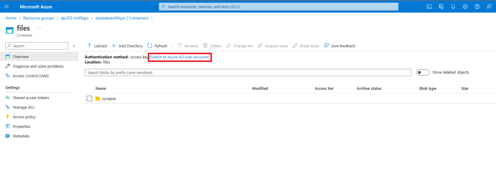

---
lab:
  title: 레이크 데이터베이스 내 데이터 분석
  ilt-use: Suggested demo
---

# 레이크 데이터베이스 내 데이터 분석

Azure Synapse Analytics를 사용하면 *레이크 데이터베이스*를 만드는 기능을 통해 데이터 레이크의 파일 스토리지 유연성을 관계형 데이터베이스의 구조적 스키마 및 SQL 쿼리 기능과 결합할 수 있습니다. 레이크 데이터베이스는 데이터 스토리지를 쿼리하는 데 사용되는 컴퓨팅과 분리할 수 있도록 하는 데이터 레이크 파일 저장소에 정의된 관계형 데이터베이스 스키마입니다. 레이크 데이터베이스는 관계형 데이터베이스 시스템에서만 일반적으로 발견되는 데이터 형식, 관계, 기타 기능에 대한 지원을 포함하는 구조화된 스키마의 이점과 관계형 데이터베이스 저장소와 독립적으로 사용할 수 있는 파일에 데이터를 저장할 수 있는 유연성을 결합합니다. 기본적으로 레이크 데이터베이스는 관계형 스키마를 데이터 레이크의 폴더에 있는 파일에 “오버레이”합니다.

이 연습을 완료하는 데 약 **45**분 정도 소요됩니다.

## 시작하기 전에

관리 수준 액세스 권한이 있는 [Azure 구독](https://azure.microsoft.com/free)이 필요합니다.

## Azure Synapse Analytics 작업 영역 프로비저닝

레이크 데이터베이스를 지원하려면 데이터 레이크 스토리지에 액세스할 수 있는 Azure Synapse Analytics 작업 영역이 필요합니다. 기본 제공 서버리스 SQL 풀을 사용하여 레이크 데이터베이스를 정의할 수 있으므로 전용 SQL 풀이 필요하지 않습니다. 필요에 따라 Spark 풀을 사용하여 레이크 데이터베이스의 데이터를 사용할 수도 있습니다.

이 연습에서는 PowerShell 스크립트와 ARM 템플릿의 조합을 사용하여 Azure Synapse Analytics 작업 영역을 프로비저닝합니다.

1. `https://portal.azure.com`에서 [Azure Portal](https://portal.azure.com)에 로그인합니다.
2. 페이지 위쪽의 검색 창 오른쪽에 있는 **[\>_]** 단추를 사용하여 Azure Portal에서 새 Cloud Shell을 만들고 ***PowerShell*** 환경을 선택하고 메시지가 표시되면 스토리지를 만듭니다. Cloud Shell은 다음과 같이 Azure Portal 아래쪽 창에 명령줄 인터페이스를 제공합니다.

    

    > **참고**: 이전에 *Bash* 환경을 사용하는 클라우드 셸을 만들었다면 클라우드 셸 창의 왼쪽 위에 있는 드롭다운 메뉴를 사용하여 ***PowerShell***로 변경합니다.

3. 창 맨 위에 있는 구분 기호 막대를 끌거나 창 오른쪽 위에 있는 **&#8212;** , **&#9723;** 및 **X** 아이콘을 사용하여 Cloud Shell 크기를 조정하여 창을 최소화, 최대화하고 닫을 수 있습니다. Azure Cloud Shell 사용에 관한 자세한 내용은 [Azure Cloud Shell 설명서](https://docs.microsoft.com/azure/cloud-shell/overview)를 참조하세요.

4. PowerShell 창에서 다음 명령을 입력하여 이 리포지토리를 복제합니다.

    ```
    rm -r dp-203 -f
    git clone https://github.com/MicrosoftLearning/dp-203-azure-data-engineer dp-203
    ```

5. 리포지토리가 복제된 후에는 다음 명령을 입력하여 이 연습의 폴더로 변경하고 포함된 **setup.ps1** 스크립트를 실행합니다.

    ```
    cd dp-203/Allfiles/labs/04
    ./setup.ps1
    ```

6. 메시지가 표시되면 사용할 구독을 선택합니다(여러 Azure 구독에 액세스할 수 있는 경우에만 발생).
7. 메시지가 표시되면 Azure Synapse SQL 풀에 설정할 적절한 암호를 입력합니다.

    > **참고**: 이 암호를 기억하세요.

8. 스크립트가 완료될 때까지 기다리세요. 일반적으로 약 10분이 걸리지만 경우에 따라 더 오래 걸릴 수 있습니다. 기다리는 동안 Azure Synapse Analytics 설명서에서 [레이크 데이터베이스](https://docs.microsoft.com/azure/synapse-analytics/database-designer/concepts-lake-database) 및 [레이크 데이터베이스 템플릿](https://docs.microsoft.com/azure/synapse-analytics/database-designer/concepts-database-templates) 문서를 검토합니다.

## 컨테이너 권한 수정

1. 배포 스크립트가 완료된 후 Azure Portal에서 만든 **dp203-*xxxxxxx*** 리소스 그룹으로 이동하여 이 리소스 그룹에 Synapse 작업 영역, 데이터 레이크에 대한 스토리지 계정, Apache Spark 풀이 포함되어 있는지 확인합니다.
1. **datalakexxxxxxx**라는 데이터 레이크에 대한 **Storage 계정을** 선택합니다. 

     

1. **datalakexxxxxx** 컨테이너 내에서 **파일 폴더**를 선택합니다.

    

1. **파일 폴더** 내에서 **인증 방법:** 액세스 키로 나열됩니다 ***(Azure AD 사용자 계정으로 전환)***. 이를 클릭하여 Azure AD 사용자 계정으로 변경합니다.

    
## 레이크 데이터베이스 만들기

레이크 데이터베이스는 작업 영역에서 정의하고 기본 제공 서버리스 SQL 풀을 사용하여 작업할 수 있는 데이터베이스 유형입니다.

1. Synapse 작업 영역을 선택하고 해당 **개요** 페이지의 **Synapse Studio 열기** 카드에서 **열기**를 선택하여 새 브라우저 탭에서 Synapse Studio를 엽니다. 메시지가 표시되면 로그인합니다.
2. Synapse Studio 왼쪽에 있는 **&rsaquo;&rsaquo;** 아이콘을 사용하여 메뉴를 확장합니다. 이렇게 하면 Synapse Studio에서 리소스를 관리하고 데이터 분석 작업을 수행하는 데 사용할 여러 페이지가 표시됩니다.
3. **데이터** 페이지에서 **연결됨** 탭을 보고 작업 영역에 Azure Data Lake Storage Gen2 스토리지 계정에 대한 링크가 포함되어 있는지 확인합니다.
4. **데이터** 페이지에서 **작업 영역** 탭으로 다시 전환하고 작업 영역에 데이터베이스가 없는지 확인합니다.
5. **+** 메뉴에서 **레이크 데이터베이스**를 선택하여 데이터베이스 스키마를 설계할 수 있는 새 탭을 엽니다(메시지가 표시되면 데이터베이스 템플릿 사용 약관에 동의).
6. 새 데이터베이스의 **속성** 창에서 **이름**을 **RetailDB** 로 변경하고 **입력 폴더** 속성이 **files/RetailDB**로 자동으로 업데이트되는지 확인합니다. **데이터 형식**을 **구분된 텍스트**로 둡니다(*Parquet* 형식을 사용할 수도 있고 개별 테이블의 파일 형식을 재정의할 수도 있습니다. 이 연습에서는 쉼표로 구분된 데이터를 사용합니다.)
7. **RetailDB** 창의 맨 위에서 **게시**를 선택하여 지금까지의 데이터베이스를 저장합니다.
8. 왼쪽의 **데이터** 창에서 **연결됨** 탭을 봅니다. 그런 다음, **synapse*xxxxxxx*** 작업 영역에 대한 **Azure Data Lake Storage Gen2** 및 기본 **datalake*xxxxxxx*** 저장소를 확장하고 현재 **synapse**라는 폴더가 포함된 **files** 파일 시스템을 선택합니다.
9.  열린 **파일** 탭에서 **+ 새 폴더** 단추를 사용하여 **RetailDB**라는 새 폴더를 만듭니다. 이는 데이터베이스의 테이블에서 사용하는 데이터 파일에 대한 입력 폴더입니다.

## 테이블 만들기

이제 레이크 데이터베이스를 만들었으므로 테이블을 만들어 해당 스키마를 정의할 수 있습니다.

### 테이블 스키마 정의

1. 데이터베이스 정의에 대한 **RetailDB** 탭으로 다시 전환하고 **+ 테이블** 목록에서 **사용자 지정**을 선택하고 **Table_1**이라는 새 테이블이 데이터베이스에 추가되는지 확인합니다.
2. **Table_1**을 선택한 상태에서 데이터베이스 설계 캔버스 아래의 **일반** 탭에서 **이름** 속성을 **Customer**로 변경합니다.
3. **테이블의 스토리지 설정** 섹션을 확장하고 테이블이 Synapse 작업 영역에 대한 기본 데이터 레이크 저장소의 **files/RetailDB/Customer** 폴더에 구분된 텍스트로 저장되는지 확인합니다.
4. **열** 탭에서 기본적으로 테이블에 **Column_1**이라는 하나의 열이 포함되어 있는지 확인합니다. 다음 속성과 일치하도록 열 정의를 편집합니다.

    | 이름 | 구성 | 설명 | Null 허용 여부 | 데이터 형식 | 형식 / 길이 |
    | ---- | ---- | ----------- | ----------- | --------- | --------------- |
    | CustomerId | PK &#128505; | 고유한 고객 ID | &#128454;  | long | |

5. **+ 열** 목록에서 **새 열**을 선택하고 새 열 정의를 수정하여 다음과 같이 **FirstName** 열을 테이블에 추가합니다.

    | 이름 | 구성 | 설명 | Null 허용 여부 | 데이터 형식 | 형식 / 길이 |
    | ---- | ---- | ----------- | ----------- | --------- | --------------- |
    | CustomerId | PK &#128505; | 고유한 고객 ID | &#128454;  | long | |
    | **FirstName** | **PK &#128454;** | **고객 이름** | **&#128454;** | **string** | **256** |

6. 테이블 정의가 다음과 같이 표시될 때까지 새 열을 더 추가합니다.

    | 이름 | 구성 | 설명 | Null 허용 여부 | 데이터 형식 | 형식 / 길이 |
    | ---- | ---- | ----------- | ----------- | --------- | --------------- |
    | CustomerId | PK &#128505; | 고유한 고객 ID | &#128454;  | long | |
    | FirstName | PK &#128454; | 고객 이름 | &#128454; | 문자열 | 256 |
    | LastName | PK &#128454; | 고객 성 | &#128505; | 문자열 | 256 |
    | EmailAddress | PK &#128454; | 고객 이메일 | &#128454; | 문자열 | 256 |
    | Phone | PK &#128454; | 고객 전화 | &#128505; | 문자열 | 256 |

7. 모든 열을 추가한 경우 데이터베이스를 다시 게시하여 변경 내용을 저장합니다.
8. 왼쪽의 **데이터** 창에서 **RetailDB** 레이크 데이터베이스를 볼 수 있도록 **작업 영역** 탭으로 다시 전환합니다. 그런 다음, 확장하여 **Tables** 폴더를 새로 고쳐 새로 만든 **Customer** 테이블을 확인합니다.

### 테이블의 스토리지 경로에 데이터 로드

1. 주 창에서 **RetailDB** 폴더가 있는 파일 시스템이 포함된 **파일** 탭으로 다시 전환합니다. 그런 다음, **RetailDB** 폴더를 열고 그 안에 **Customer**라는 새 폴더를 만듭니다. 여기서 **Customer** 테이블은 해당 데이터를 가져옵니다.
2. 비어 있어야 하는 새 **Customer** 폴더를 엽니다.
3. [https://raw.githubusercontent.com/MicrosoftLearning/dp-203-azure-data-engineer/master/Allfiles/labs/04/data/customer.csv](https://raw.githubusercontent.com/MicrosoftLearning/dp-203-azure-data-engineer/master/Allfiles/labs/04/data/customer.csv)에서 **customer.csv** 데이터 파일을 다운로드하고 로컬 컴퓨터의 폴더에 저장합니다(위치는 중요하지 않음). 그런 다음, Synapse Explorer의 **Customer** 폴더에서 **&#10514; 업로드** 단추를 사용하여 데이터 레이크의 **RetailDB/Customer** 폴더에 **customer.csv** 파일을 업로드합니다.

    > **참고**: 실제 프로덕션 시나리오에서는 테이블 데이터의 폴더에 데이터를 수집하는 파이프라인을 만들 수 있습니다. 편의를 위해 이 연습의 Synapse Studio 사용자 인터페이스에 직접 업로드합니다.

4. 왼쪽의 **데이터** 창에 있는 **작업 영역** 탭의 **Customer** 테이블에 대한 **...** 메뉴에서 **새 SQL 스크립트** > **상위 100개 행 선택**을 선택합니다. 그런 다음, 열린 새 **SQL 스크립트 1** 창에서 **기본 제공** SQL 풀이 연결되어 있는지 확인하고 **&#9655; 실행** 단추를 사용하여 SQL 코드를 실행합니다. 결과에는 데이터 레이크의 기본 폴더에 저장된 데이터를 기반으로 **Customer** 테이블의 처음 100개 행이 포함되어야 합니다.
5. **SQL 스크립트 1** 탭을 닫고 변경 내용을 삭제합니다.

## 데이터베이스 템플릿에서 테이블 만들기

앞에서 보았듯이 레이크 데이터베이스에 필요한 테이블을 처음부터 만들 수 있습니다. 그러나 Azure Synapse Analytics는 데이터베이스 스키마의 시작점으로 사용할 수 있는 일반적인 데이터베이스 워크로드 및 엔터티를 기반으로 하는 수많은 데이터베이스 템플릿도 제공합니다.

### 테이블 스키마 정의

1. 주 창에서 데이터베이스 스키마(현재 **Customer** 테이블만 포함)가 포함된 **RetailDB** 창으로 다시 전환합니다.
2. **+ 테이블** 메뉴에서 **템플릿에서**를 선택합니다. 그런 다음, **템플릿에서 추가** 페이지에서 **Retail**을 선택하고 **계속**을 클릭합니다.
3. **템플릿에서 추가(Retail)** 페이지에서 테이블 목록이 채워지도록 기다린 다음, **Product**를 확장하고 **RetailProduct**를 선택합니다. 그런 다음, **추가**를 클릭합니다. 그러면 **RetailProduct** 템플릿을 기반으로 하는 새 테이블이 데이터베이스에 추가됩니다.
4. **RetailDB** 창에서 새 **RetailProduct** 테이블을 선택합니다. 그런 다음, 설계 캔버스 아래의 창의 **일반** 탭에서 이름을 **Product**로 변경하고 테이블의 스토리지 설정이 입력 폴더 **files/RetailDB/Product**를 지정했는지 확인합니다.
5. **Product** 테이블의 **열** 탭에서 테이블에 템플릿에서 상속된 많은 수의 열이 이미 포함되어 있는지 확인합니다. 이 테이블에 필요한 것보다 많은 열이 있으므로 일부 열을 제거해야 합니다.
6. **이름** 옆의 확인란을 선택하여 모든 열을 선택한 다음, 다음 열(유지해야 하는 열)을 선택 <u>취소</u>합니다.
    - ProductId
    - ProductName
    - IntroductionDate
    - ActualAbandonmentDate
    - ProductGrossWeight
    - ItemSku
7. **열** 창의 도구 모음에서 **삭제**를 선택하여 선택한 열을 제거합니다. 이렇게 하면 다음 열이 남게 됩니다.

    | 이름 | 구성 | 설명 | Null 허용 여부 | 데이터 형식 | 형식 / 길이 |
    | ---- | ---- | ----------- | ----------- | --------- | --------------- |
    | ProductId | PK &#128505; | Product의 고유 식별자입니다. | &#128454;  | long | |
    | ProductName | PK &#128454; | Product의 이름... | &#128505; | 문자열 | 128 |
    | IntroductionDate | PK &#128454; | Product를 판매하기 위해 도입된 날짜입니다. | &#128505; | 날짜 | YYYY-MM-DD |
    | ActualAbandonmentDate | PK &#128454; | 제품의 마케팅이 중단된 실제 날짜... | &#128505; | 날짜 | YYY-MM-DD |
    | ProductGrossWeight | PK &#128454; | 총 제품 중량입니다. | &#128505; | decimal | 18,8 |
    | ItemSku | PK &#128454; | Stock Keeping Unit 식별자... | &#128505; | 문자열 | 20 |

8. 다음과 같이 **ListPrice**라는 새 열을 테이블에 추가합니다.

    | 이름 | 구성 | 설명 | Null 허용 여부 | 데이터 형식 | 형식 / 길이 |
    | ---- | ---- | ----------- | ----------- | --------- | --------------- |
    | ProductId | PK &#128505; | Product의 고유 식별자입니다. | &#128454;  | long | |
    | ProductName | PK &#128454; | Product의 이름... | &#128505; | 문자열 | 128 |
    | IntroductionDate | PK &#128454; | Product를 판매하기 위해 도입된 날짜입니다. | &#128505; | 날짜 | YYYY-MM-DD |
    | ActualAbandonmentDate | PK &#128454; | 제품의 마케팅이 중단된 실제 날짜... | &#128505; | 날짜 | YYY-MM-DD |
    | ProductGrossWeight | PK &#128454; | 총 제품 중량입니다. | &#128505; | decimal | 18,8 |
    | ItemSku | PK &#128454; | Stock Keeping Unit 식별자... | &#128505; | 문자열 | 20 |
    | **ListPrice** | **PK &#128454;** | **제품 가격입니다.** | **&#128454;** | **decimal** | **18,2** |

9. 위와 같이 열을 수정한 경우 데이터베이스를 다시 게시하여 변경 내용을 저장합니다.
10. 왼쪽의 **데이터** 창에서 **RetailDB** 레이크 데이터베이스를 볼 수 있도록 **작업 영역** 탭으로 다시 전환합니다. 그런 다음, **Tables** 폴더의 **...** 메뉴를 사용하여 보기를 새로 고치고 새로 만든 **Product** 테이블을 확인합니다.

### 테이블의 스토리지 경로에 데이터 로드

1. 기본 창에서 파일 시스템이 포함된 **파일** 탭으로 다시 전환하고, 이전에 만든 테이블에 대한 **Customer** 폴더가 현재 포함된 **files/RetailDB** 폴더로 이동합니다.
2. **RetailDB** 폴더에서 **Product**라는 새 폴더를 만듭니다. 여기서 **Product** 테이블은 해당 데이터를 가져옵니다.
3. 비어 있어야 하는 새 **Product** 폴더를 엽니다.
4. [https://raw.githubusercontent.com/MicrosoftLearning/dp-203-azure-data-engineer/master/Allfiles/labs/04/data/product.csv](https://raw.githubusercontent.com/MicrosoftLearning/dp-203-azure-data-engineer/master/Allfiles/labs/04/data/product.csv)에서 **product.csv** 데이터 파일을 다운로드하고 로컬 컴퓨터의 폴더에 저장합니다(위치는 중요하지 않음). 그런 다음, Synapse Explorer의 **Product** 폴더에서 **&#10514; 업로드** 단추를 사용하여 데이터 레이크의 **RetailDB/Product** 폴더에 **product.csv** 파일을 업로드합니다.
5. 왼쪽의 **데이터** 창에 있는 **작업 영역** 탭의 **Product** 테이블에 대한 **...** 메뉴에서 **새 SQL 스크립트** > **상위 100개 행 선택**을 선택합니다. 그런 다음, 열린 새 **SQL 스크립트 1** 창에서 **기본 제공** SQL 풀이 연결되어 있는지 확인하고 **&#9655; 실행** 단추를 사용하여 SQL 코드를 실행합니다. 결과에는 데이터 레이크의 기본 폴더에 저장된 데이터를 기반으로 **Product** 테이블의 처음 100개 행이 포함되어야 합니다.
6. **SQL 스크립트 1** 탭을 닫고 변경 내용을 삭제합니다.

## 기존 데이터에서 테이블 만들기

지금까지 테이블을 만든 다음, 데이터로 채웠습니다. 경우에 따라 테이블을 파생하려는 데이터 레이크에 이미 데이터가 있을 수 있습니다.

### 데이터 업로드

1. 기본 창에서 파일 시스템이 포함된 **파일** 탭으로 다시 전환하고, 이전에 만든 테이블에 대한 **Customer** 및 **Product** 폴더가 현재 포함된 **files/RetailDB** 폴더로 이동합니다.
2. **RetailDB** 폴더에서 **SalesOrder**라는 새 폴더를 만듭니다.
3. 비어 있어야 하는 새 **SalesOrder** 폴더를 엽니다.
4. [https://raw.githubusercontent.com/MicrosoftLearning/dp-203-azure-data-engineer/master/Allfiles/labs/04/data/salesorder.csv](https://raw.githubusercontent.com/MicrosoftLearning/dp-203-azure-data-engineer/master/Allfiles/labs/04/data/salesorder.csv)에서 **salesorder.csv** 데이터 파일을 다운로드하고 로컬 컴퓨터의 폴더에 저장합니다(위치는 중요하지 않음). 그런 다음, Synapse Explorer의 **SalesOrder** 폴더에서 **&#10514; 업로드** 단추를 사용하여 데이터 레이크의 **RetailDB/SalesOrder** 폴더에 **salesorder.csv** 파일을 업로드합니다.

### 테이블 만들기

1. 주 창에서 데이터베이스 스키마(현재 **Customer** 및 **Product** 테이블 포함)가 포함된 **RetailDB** 창으로 다시 전환합니다.
2. **+ 테이블** 메뉴에서 **데이터 레이크에서**를 선택합니다. 그런 다음, **데이터 레이크에서 외부 테이블 만들기** 창에서 다음 옵션을 지정합니다.
    - **외부 테이블 이름**: SalesOrder
    - **연결된 서비스**: **synapse*xxxxxxx*-WorkspaceDefautStorage(datalake*xxxxxxx*)** 선택
    - **폴더의 입력 파일**: files/RetailDB/SalesOrder
3. 다음 페이지로 이동한 다음, 다음 옵션을 사용하여 테이블을 만듭니다.
    - **파일 형식**: CSV
    - **필드 종결자**: 기본값(쉼표 ,)
    - **첫 번째 행**: *열 이름 유추*를 선택 <u>취소</u>된 상태로 둡니다.
    - **문자열 구분 기호**: 기본값(빈 문자열)
    - **기본 형식 사용**: 기본 형식(true,false)
    - **최대 문자열 길이**: 4000

4. 테이블이 만들어지면 **C1**, **C2** 등의 열이 포함되며 폴더의 데이터에서 데이터 형식이 유추되었는지 확인합니다. 다음과 같이 열 정의를 수정합니다.

    | 이름 | 구성 | 설명 | Null 허용 여부 | 데이터 형식 | 형식 / 길이 |
    | ---- | ---- | ----------- | ----------- | --------- | --------------- |
    | SalesOrderId | PK &#128505; | 주문의 고유 식별자입니다. | &#128454;  | long | |
    | OrderDate | PK &#128454; | 주문 날짜입니다. | &#128454; | timestamp | yyyy-MM-dd |
    | LineItemId | PK &#128505; | 개별 품목의 ID입니다. | &#128454; | long | |
    | CustomerId | PK &#128454; | 고객입니다. | &#128454; | long | |
    | ProductId | PK &#128454; | 제품입니다. | &#128454; | long | |
    | Quantity | PK &#128454; | 주문 수량입니다. | &#128454; | long | |

    > **참고**: 테이블에는 정렬된 각 개별 항목에 대한 레코드가 포함되며 **SalesOrderId** 및 **LineItemId**로 구성된 복합 기본 키가 포함됩니다.

5. **SalesOrder** 테이블의 **관계** 탭에 있는 **+ 관계** 목록에서 **테이블로**를 선택한 다음, 다음 관계를 정의합니다.

    | 테이블에서 | 열에서 | 테이블로 | 열로 |
    | ---- | ---- | ----------- | ----------- |
    | Customer | CustomerId | SalesOrder | CustomerId |

6. 다음 설정을 사용하여 두 번째 *테이블로* 관계를 추가합니다.

    | 테이블에서 | 열에서 | 테이블로 | 열로 |
    | ---- | ---- | ----------- | ----------- |
    | 제품 | ProductId | SalesOrder | ProductId |

    테이블 간의 관계를 정의하는 기능은 관련 데이터 엔터티 간에 참조 무결성을 적용하는 데 도움이 됩니다. 이는 데이터 레이크의 파일에 적용하기 어려운 관계형 데이터베이스의 일반적인 기능입니다.

7. 데이터베이스를 다시 게시하여 변경 내용을 저장합니다.
8. 왼쪽의 **데이터** 창에서 **RetailDB** 레이크 데이터베이스를 볼 수 있도록 **작업 영역** 탭으로 다시 전환합니다. 그런 다음, **Tables** 폴더의 **...** 메뉴를 사용하여 보기를 새로 고치고 새로 만든 **SalesOrder** 테이블을 확인합니다.

## 레이크 데이터베이스 테이블 작업

이제 데이터베이스에 일부 테이블이 있으므로 이를 사용하여 기본 데이터로 작업할 수 있습니다.

### SQL을 사용하여 테이블 쿼리

1. Synapse Studio에서 **개발** 페이지를 선택합니다.
2. **개발** 창의 **+** 메뉴에서 **SQL 스크립트**를 선택합니다.
3. 새 **SQL 스크립트 1** 창에서 스크립트가 **기본 제공** SQL 풀에 연결되어 있는지 확인하고 **사용자 데이터베이스** 목록에서 **RetailDB**를 선택합니다.
4. 다음 SQL 코드를 입력합니다.

    ```sql
    SELECT o.SalesOrderID, c.EmailAddress, p.ProductName, o.Quantity
    FROM SalesOrder AS o
    JOIN Customer AS c ON o.CustomerId = c.CustomerId
    JOIN Product AS p ON o.ProductId = p.ProductId
    ```

5. **&#9655; 실행** 단추를 사용하여 SQL 코드를 실행합니다.

    결과에는 고객 및 제품 정보가 포함된 주문 세부 정보가 표시됩니다.

6. **SQL 스크립트 1** 창을 닫고 변경 내용을 삭제합니다.

### Spark를 사용하여 데이터 삽입

1. **개발** 창의 **+** 메뉴에서 **Notebook**을 선택합니다.
2. 새 **Notebook 1** 창에서 Notebook을 **spark*xxxxxxx**** Spark 풀에 연결합니다.
3. 빈 Notebook 셀에 다음 코드를 입력합니다.

    ```
    %%sql
    INSERT INTO `RetailDB`.`SalesOrder` VALUES (99999, CAST('2022-01-01' AS TimeStamp), 1, 6, 5, 1)
    ```

4. 셀 왼쪽의 **&#9655;** 단추를 사용하여 실행하고 실행이 완료되기를 기다립니다. Spark 풀을 시작하는 데 다소 시간이 걸립니다.
5. **+ 코드** 단추를 사용하여 Notebook에 새 셀을 추가합니다.
6. 새 셀에서 다음 코드를 입력합니다.

    ```
    %%sql
    SELECT * FROM `RetailDB`.`SalesOrder` WHERE SalesOrderId = 99999
    ```
7. 셀 왼쪽의 **&#9655;** 단추를 사용하여 실행한 후 **SalesOrder** 테이블에 판매 주문 99999의 행이 삽입되었는지 확인합니다.
8. **Notebook 1** 창을 닫고 Spark 세션을 중지하고 변경 내용을 삭제합니다.

## Azure 리소스 삭제

Azure Synapse Analytics 탐색을 완료했으므로, 지금까지 만든 리소스를 삭제하여 불필요한 Azure 비용을 방지해야 합니다.

1. Synapse Studio 브라우저 탭을 닫고 Azure Portal로 돌아갑니다.
2. Azure Portal의 **홈** 페이지에서 **리소스 그룹**을 선택합니다.
3. (관리되는 리소스 그룹이 아닌) Synapse Analytics 작업 영역에 대한 **dp203-*xxxxxxx*** 리소스 그룹을 선택하고 Synapse 작업 영역, 스토리지 계정, 작업 영역용 Spark 풀이 포함되어 있는지 확인합니다.
4. 리소스 그룹의 **개요** 페이지에서 **리소스 그룹 삭제**를 선택합니다.
5. **dp203-*xxxxxxx*** 리소스 그룹 이름을 입력하여 삭제 의사를 확인한 다음, **삭제**를 선택합니다.

    몇 분이 지나면 Azure Synapse 작업 영역 리소스 그룹과 여기에 연결된 관리 작업 영역 리소스 그룹이 삭제됩니다.
