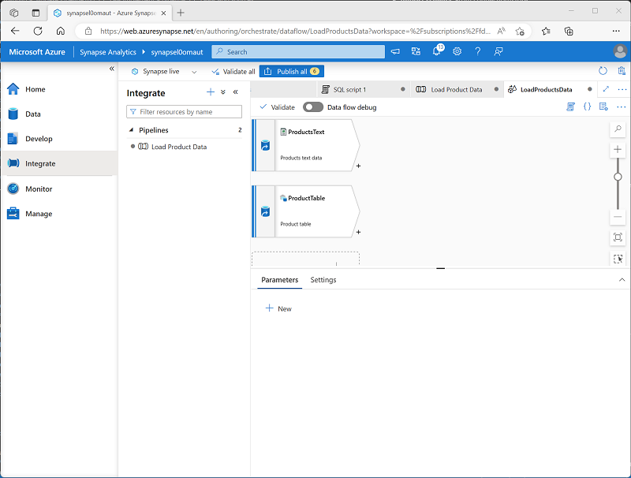
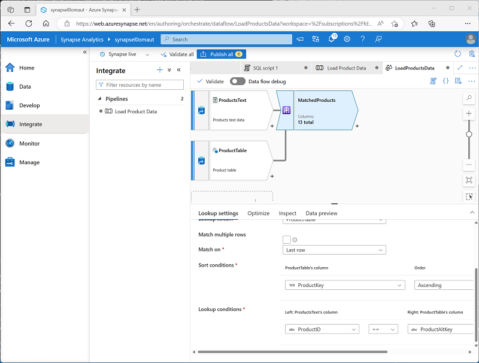

---
lab:
  title: Azure Synapse Analytics에서 데이터 파이프라인 빌드
  ilt-use: Lab
---

# Azure Synapse Analytics에서 데이터 파이프라인 빌드

이 연습에서는 Azure Synapse Analytics Explorer의 파이프라인을 사용하여 전용 SQL 풀에 데이터를 로드합니다. 파이프라인은 제품 데이터를 데이터 웨어하우스의 테이블에 로드하는 데이터 흐름을 캡슐화합니다.

이 연습을 완료하는 데 약 **45**분 정도 소요됩니다.

## 시작하기 전에

관리 수준 액세스 권한이 있는 [Azure 구독](https://azure.microsoft.com/free)이 필요합니다.

## Azure Synapse Analytics 작업 영역 프로비저닝

데이터 레이크 스토리지 및 관계형 데이터 웨어하우스를 호스트하는 전용 SQL 풀에 액세스할 수 있는 Azure Synapse Analytics 작업 영역이 필요합니다.

이 연습에서는 PowerShell 스크립트와 ARM 템플릿의 조합을 사용하여 Azure Synapse Analytics 작업 영역을 프로비저닝합니다.

1. `https://portal.azure.com`에서 [Azure Portal](https://portal.azure.com)에 로그인합니다.
2. 페이지 위쪽의 검색 창 오른쪽에 있는 **[\>_]** 단추를 사용하여 Azure Portal에서 새 Cloud Shell을 만들고 ***PowerShell*** 환경을 선택하고 메시지가 표시되면 스토리지를 만듭니다. Cloud Shell은 다음과 같이 Azure Portal 아래쪽 창에 명령줄 인터페이스를 제공합니다.

    

    > **참고**: 이전에 *Bash* 환경을 사용하는 클라우드 셸을 만들었다면 클라우드 셸 창의 왼쪽 위에 있는 드롭다운 메뉴를 사용하여 ***PowerShell***로 변경합니다.

3. Cloud Shell은 창 맨 위에 있는 구분 기호 막대를 끌거나 창 오른쪽 위에 있는 —, **&#9723;** , **X** 아이콘을 사용하여 크기를 조정하여 창을 최소화, 최대화하고 닫을 수 있습니다. Azure Cloud Shell 사용에 관한 자세한 내용은 [Azure Cloud Shell 설명서](https://docs.microsoft.com/azure/cloud-shell/overview)를 참조하세요.

4. PowerShell 창에서 다음 명령을 입력하여 이 리포지토리를 복제합니다.

    ```powershell
    rm -r dp-203 -f
    git clone https://github.com/MicrosoftLearning/dp-203-azure-data-engineer dp-203
    ```

5. 리포지토리가 복제된 후에는 다음 명령을 입력하여 이 연습의 폴더로 변경하고 포함된 **setup.ps1** 스크립트를 실행합니다.

    ```powershell
    cd dp-203/Allfiles/labs/10
    ./setup.ps1
    ```

6. 메시지가 표시되면 사용할 구독을 선택합니다(여러 Azure 구독에 액세스할 수 있는 경우에만 발생).
7. 메시지가 표시되면 Azure Synapse SQL 풀에 설정할 적절한 암호를 입력합니다.

    > **참고**: 이 암호를 기억하세요.

8. 스크립트가 완료될 때까지 기다리세요. 일반적으로 약 10분이 걸리지만 경우에 따라 더 오래 걸릴 수 있습니다. 기다리는 동안 Azure Synapse Analytics 설명서에서 [Azure Synapse Analytics의 데이터 흐름](https://learn.microsoft.com/azure/synapse-analytics/concepts-data-flow-overview) 문서를 검토합니다.

## 원본 및 대상 데이터 저장소 보기

이 연습의 원본 데이터는 제품 데이터를 포함하는 텍스트 파일입니다. 대상은 전용 SQL 풀의 테이블입니다. 목표는 파일의 제품 데이터가 테이블에 로드되는 데이터 흐름을 캡슐화하는 파이프라인을 만들어 새 제품을 삽입하고 기존 제품을 업데이트하는 것입니다.

1. 스크립트가 완료되면 Azure Portal에서 만든 **dp203-*xxxxxxx*** 리소스 그룹으로 이동하여 Synapse 작업 영역을 선택합니다.
2. Synapse 작업 영역에 있는 **개요** 페이지의 **Synapse Studio 열기** 카드에서 **열기**를 선택하여 새 브라우저 탭에서 Synapse Studio 엽니다. 메시지가 표시되면 로그인합니다.
3. Synapse Studio 왼쪽에 있는 ›› 아이콘을 사용하여 메뉴를 확장합니다. 이렇게 하면 Synapse Studio에서 리소스를 관리하고 데이터 분석 작업을 수행하는 데 사용할 여러 페이지가 표시됩니다.
4. **관리** 페이지의 **SQL 풀** 탭에서 **sql*xxxxxxx*** 전용 SQL 풀에 대한 행을 선택하고 **&#9655;** 아이콘을 사용하여 시작합니다. 메시지가 표시되면 다시 시작하려는지 확인합니다.

     풀을 다시 시작하는 데 몇 분 정도 걸릴 수 있습니다. **&#8635; 새로 고침** 단추를 사용하여 상태를 주기적으로 확인할 수 있습니다. 준비되면 상태가 **온라인**으로 표시됩니다. 기다리는 동안 아래 단계를 계속 진행하여 원본 데이터를 확인합니다.

5. **데이터** 페이지에서 **연결된** 탭을 보고 작업 영역에 **synapse*xxxxxxx*(Primary - datalake*xxxxxxx*)**와 유사한 이름을 가진 Azure Data Lake Storage Gen2 스토리지 계정에 대한 링크가 포함되어 있는지 확인합니다.
6. 스토리지 계정을 확장하고 **파일(기본)** 이라는 파일 시스템 컨테이너가 포함되어 있는지 확인합니다.
7. 파일 컨테이너를 선택하고 **데이터**라는 폴더가 포함되어 있는지 확인합니다.
8. **데이터** 폴더를 열고 포함된 **Product.csv** 파일을 확인합니다.
9. **Product.csv**를 마우스 오른쪽 단추로 클릭하고 **미리 보기**를 선택하여 포함된 데이터를 확인합니다. 머리글 행과 제품 데이터의 일부 레코드가 포함되어 있는지 확인합니다.
10. **관리** 페이지로 돌아가 전용 SQL 풀이 이제 온라인인지 확인합니다. 그렇지 않은 경우 기다립니다.
11. **데이터** 페이지의 **작업 영역** 탭에서 **SQL 데이터베이스**, **sql*xxxxxxx*(SQL)* * 데이터베이스, 해당 **테이블**을 확장합니다.
12. **dbo.DimProduct** 테이블을 선택합니다. 그런 다음, **...** 메뉴에서 **새 SQL 스크립트** > **상위 100개 행 선택**을 선택합니다. 그러면 테이블에서 제품 데이터를 반환하는 쿼리가 실행되며, 단일 행이 있어야 합니다.

## 파이프라인 구현

텍스트 파일의 데이터를 데이터베이스 테이블에 로드하려면 텍스트 파일에서 데이터를 수집하는 논리를 캡슐화하는 데이터 흐름을 포함하는 Azure Synapse Analytics 파이프라인을 구현하고, 데이터베이스에 이미 있는 제품의 서로게이트 **ProductKey** 열을 조회한 다음, 그에 따라 테이블에 행을 삽입하거나 업데이트합니다.

### 데이터 흐름 작업으로 파이프라인 만들기

1. Synapse Studio에서 **통합** 페이지를 선택합니다. 그런 다음, **+** 메뉴에서 **파이프라인**을 선택하여 새 파이프라인을 만듭니다.
2. 새 파이프라인의 **속성** 창에서 이름을 **Pipeline1**에서 **제품 데이터 로드**로 변경합니다. 그런 다음, **속성** 창 위의 **속성** 단추를 사용하여 숨깁니다.
3. **활동** 창에서 **이동 및 변환**을 확장합니다. 그런 다음, 다음과 같이 **데이터 흐름**을 파이프라인 디자인 화면으로 끌어옵니다.

    

4. 파이프라인 디자인 화면의 **일반** 탭에서 **이름** 속성을 **LoadProducts**로 설정합니다.
5. **설정** 탭의 설정 목록 아래쪽에서 **준비**를 확장하고 다음 준비 설정을 설정합니다.
    - **준비 연결된 서비스**: **synapse*xxxxxxx*-WorkspaceDefaultStorage** 연결된 서비스를 선택합니다.
    - **준비 스토리지 폴더**: **컨테이너**를 **파일**로 설정하고 **디렉터리**를 **stage_products**로 설정합니다.

### 데이터 흐름 구성

1. **LoadProducts** 데이터 흐름의 **설정** 탭 맨 위에서 **데이터 흐름** 속성에 대해 **+ 새로 만들기**를 선택합니다.
2. 열리는 새 데이터 흐름 디자인 화면의 **속성** 창에서 **이름**을 **LoadProductsData**로 설정한 다음, **속성** 창을 숨깁니다. 데이터 흐름 디자이너는 다음과 같아야 합니다.

    

### 원본 추가

1. 데이터 흐름 디자인 화면의 **원본 추가** 드롭다운 목록에서 **원본 추가**를 선택합니다. 그런 다음, 다음과 같이 원본 설정을 구성합니다.
    - **출력 스트림 이름**: ProductsText
    - **설명**: 제품 텍스트 데이터
    - **원본 유형**: 통합 데이터 세트
    - **데이터 세트**: 다음 속성을 사용하여 **새** 데이터 세트를 추가합니다.
        - **형식**: Azure Datalake Storage Gen2
        - **형식**: 구분된 텍스트
        - **이름**: Products_Csv
        - **연결된 서비스**: synapse*xxxxxxx*-WorkspaceDefaultStorage
        - **파일 경로**: files/data/Product.csv
        - **첫 번째 행을 머리글로**: 선택됨
        - **스키마 가져오기**: 연결/저장소에서
    - **스키마 드리프트 허용**: 선택됨
2. 새 **ProductsText** 원본에 대한 **프로젝션** 탭에서 다음 데이터 형식을 설정합니다.
    - **ProductID**: 문자열
    - **ProductName**: 문자열
    - **Color**: 문자열
    - **Size**: 문자열
    - **ListPrice**: 10진수
    - **Discontinued**: 부울
3. 다음 속성을 사용하여 두 번째 원본을 추가합니다.
    - **출력 스트림 이름**: ProductTable
    - **설명**: 제품 테이블
    - **원본 유형**: 통합 데이터 세트
    - **데이터 세트**: 다음 속성을 사용하여 **새** 데이터 세트를 추가합니다.
        - **형식**: Azure Synapse Analytics
        - **이름**: DimProduct
        - **연결된 서비스**: 다음 속성을 사용하여 **새** 연결된 서비스를 만듭니다.
            - **이름**: Data_Warehouse
            - **설명**: 전용 SQL 풀
            - **통합 런타임을 통해 연결**: AutoResolveIntegrationRuntime
            - **버전**: 레거시
            - **계정 선택 방법**: Azure 구독에서
            - **Azure 구독**: Azure 구독 선택
            - **서버 이름**: synapse*xxxxxxx*(Synapse 작업 영역)
            - **데이터베이스 이름**: sql*xxxxxxx*
            - **SQL 풀**: sql*xxxxxxx*
            **인증 유형**: 시스템 할당 관리 ID
        - **테이블 이름**: dbo.DimProduct
        - **스키마 가져오기**: 연결/저장소에서
    - **스키마 드리프트 허용**: 선택됨
4. 새 **ProductTable** 원본에 대한 **프로젝션** 탭에서 다음 데이터 형식이 설정되어 있는지 확인합니다.
    - **ProductKey**: 정수
    - **ProductAltKey**: 문자열
    - **ProductName**: 문자열
    - **Color**: 문자열
    - **Size**: 문자열
    - **ListPrice**: 10진수
    - **Discontinued**: 부울
5. 다음과 같이 데이터 흐름에 두 개의 원본이 포함되어 있는지 확인합니다.

    

### 조회 추가

1. **ProductsText** 원본의 오른쪽 아래에 있는 **+** 아이콘을 선택하고 **조회**를 선택합니다.
2. 다음과 같이 조회 설정을 구성합니다.
    - **출력 스트림 이름**: MatchedProducts
    - **설명**: 일치하는 제품 데이터
    - **기본 스트림**: ProductText
    - **조회 스트림**: ProductTable
    - **여러 행 일치**: 선택 <u>취소됨</u>
    - **일치 대상**: 마지막 행
    - **정렬 조건**: ProductKey 오름차순
    - **조회 조건**: ProductID == ProductAltKey
3. 데이터 흐름이 다음과 같은지 확인합니다.

    

    조회는 *두* 원본에서 열 집합을 반환하며, 기본적으로 텍스트 파일의 **ProductID** 열과 일치하는 외부 조인을 데이터 웨어하우스 테이블의 **ProductAltKey** 열에 형성합니다. 대체 키가 있는 제품이 테이블에 이미 있는 경우 데이터 세트에는 두 원본의 값이 모두 포함됩니다. 제품이 데이터 웨어하우스에 아직 없는 경우 데이터 세트에는 테이블 열에 대한 NULL 값이 포함됩니다.

### 행 변경 추가

1. **MatchedProducts** 조회의 오른쪽 아래에 있는 **+** 아이콘을 선택하고 **행 변경**을 선택합니다.
2. 다음과 같이 행 변경 설정을 구성합니다.
    - **출력 스트림 이름**: SetLoadAction
    - **설명**: 새로 삽입, 기존 upsert
    - **들어오는 스트림**: MatchedProducts
    - **행 조건 변경**: 기존 조건을 편집하고 **+** 단추를 사용하여 다음과 같이 두 번째 조건을 추가합니다(식은 *대/소문자를 구분*함).
        - InsertIf: `isNull(ProductKey)`
        - UpsertIf: `not(isNull(ProductKey))`
3. 데이터 흐름이 다음과 같은지 확인합니다.

    

    행 변경 단계는 각 행에 대해 수행할 로드 작업의 종류를 구성합니다. 테이블에 기존 행이 없는 경우(**ProductKey**가 null임) 텍스트 파일의 행이 삽입됩니다. 제품에 대한 행이 이미 있는 경우 *upsert*가 수행되어 기존 행을 업데이트합니다. 이 구성은 기본적으로 *형식 1 느린 변경 차원 업데이트*를 적용합니다.

### 싱크 추가

1. **SetLoadAction** 행 변경 단계의 오른쪽 아래에 있는 **+** 아이콘을 선택하고 **싱크**를 선택합니다.
2. 다음과 같이 **싱크** 속성을 구성합니다.
    - **출력 스트림 이름**: DimProductTable
    - **설명**: DimProduct 테이블 로드
    - **들어오는 스트림**: SetLoadAction
    - **싱크 유형**: 통합 데이터 세트
    - **데이터 세트**: DimProduct
    - **스키마 드리프트 허용**: 선택됨
3. 새 **DimProductTable** 싱크의 **설정** 탭에서 다음 설정을 지정합니다.
    - **업데이트 방법**: **삽입 허용** 및 **upsert 허용**을 선택합니다.
    - **키 열**: **열 목록**을 선택한 다음, **ProductAltKey** 열을 선택합니다.
4. 새 **DimProductTable** 싱크에 대한 **매핑** 탭에서 **자동 매핑** 확인란의 선택을 취소하고 다음 열 매핑<u>만</u> 지정합니다.
    - ProductID: ProductAltKey
    - ProductsText@ProductName: ProductName
    - ProductsText@Color: Color
    - ProductsText@Size: 크기
    - ProductsText@ListPrice: ListPrice
    - ProductsText@Discontinued: Discontinued
5. 데이터 흐름이 다음과 같은지 확인합니다.

    

## 데이터 흐름 디버그

파이프라인에서 데이터 흐름을 빌드했으므로 게시하기 전에 디버그할 수 있습니다.

1. 데이터 흐름 디자이너 맨 위에서 **데이터 흐름 디버그**를 사용하도록 설정했습니다. 기본 구성을 검토하고 **확인**을 선택한 다음, 디버그 클러스터가 시작될 때까지 기다립니다(몇 분 정도 걸릴 수 있음).
2. 데이터 흐름 디자이너에서 **DimProductTable** 싱크를 선택하고 해당 **데이터 미리 보기** 탭을 봅니다.
3. **&#8635; 새로 고침** 단추를 사용하여 데이터 흐름을 통해 데이터를 실행하여 디버그하는 효과가 있는 미리 보기를 새로 고칩니다.
4. 미리 보기 데이터를 검토하여 **<sub>*</sub><sup>+</sup>** 아이콘으로 표시된 하나의 upsert된 행(기존 *AR5381* 제품의 경우)과 **+** 아이콘으로 표시된 10개의 삽입된 행을 나타냅니다.

## 파이프라인 게시 및 실행

이제 파이프라인을 게시하고 실행할 준비가 되었습니다.

1. **모두 게시** 단추를 사용하여 파이프라인(및 기타 저장되지 않은 자산)을 게시합니다.
2. 게시가 완료되면 **LoadProductsData** 데이터 흐름 창을 닫고 **제품 데이터 로드** 파이프라인 창으로 돌아갑니다.
3. 파이프라인 디자이너 창의 위쪽에 있는 **트리거 추가** 메뉴에서 **지금 트리거**를 선택합니다. 그런 다음, **확인**을 선택하여 파이프라인 실행을 확인합니다.

    **참고**: 예약된 시간에 또는 특정 이벤트에 대한 응답으로 파이프라인을 실행하는 트리거를 만들 수도 있습니다.

4. 파이프라인이 실행되기 시작하면 **모니터링** 페이지에서 **파이프라인 실행** 탭을 보고 **제품 데이터 로드** 파이프라인의 상태를 검토합니다.

    파이프라인을 완료하는 데 5분 이상이 걸릴 수 있습니다. 도구 모음의 **&#8635; 새로 고침** 단추를 사용하여 상태를 확인할 수 있습니다.

5. 파이프라인 실행이 성공하면 **데이터** 페이지에서 SQL 데이터베이스의 **dbo.DimProduct** 테이블에 대한 **...** 메뉴를 사용하여 상위 100개 행을 선택하는 쿼리를 실행합니다. 테이블에는 파이프라인에 의해 로드된 데이터가 포함되어야 합니다.
   
## Azure 리소스 삭제

Azure Synapse Analytics 탐색을 완료했으므로, 지금까지 만든 리소스를 삭제하여 불필요한 Azure 비용을 방지해야 합니다.

1. Synapse Studio 브라우저 탭을 닫고 Azure Portal로 돌아갑니다.
2. Azure Portal의 **홈** 페이지에서 **리소스 그룹**을 선택합니다.
3. (관리되는 리소스 그룹이 아닌) Synapse Analytics 작업 영역에 대한 **dp203-*xxxxxxx*** 리소스 그룹을 선택하고 Synapse 작업 영역, 스토리지 계정, 작업 영역용 전용 SQL 풀이 포함되어 있는지 확인합니다.
4. 리소스 그룹의 **개요** 페이지에서 **리소스 그룹 삭제**를 선택합니다.
5. **dp203-*xxxxxxx*** 리소스 그룹 이름을 입력하여 삭제 의사를 확인한 다음, **삭제**를 선택합니다.

    몇 분이 지나면 Azure Synapse 작업 영역 리소스 그룹과 여기에 연결된 관리 작업 영역 리소스 그룹이 삭제됩니다.
