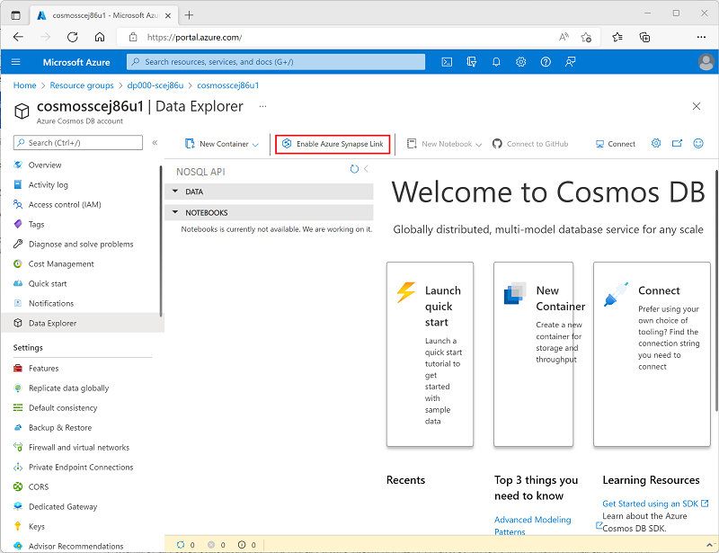

---
lab:
  title: Azure Cosmos DB용 Azure Synapse Link 사용
  ilt-use: Lab
---

# Azure Cosmos DB용 Azure Synapse Link 사용

Azure Cosmos DB용 Azure Synapse Link는 Azure Synapse Analytics에서 Azure Cosmos DB에 저장된 작동 데이터에 대해 거의 실시간으로 분석을 실행할 수 있도록 지원하는 클라우드 네이티브 HTAP(*하이브리드 트랜잭션 분석 처리*) 기능입니다.

이 연습을 완료하는 데 약 **35**분 정도 소요됩니다.

## 시작하기 전에

관리 수준 액세스 권한이 있는 [Azure 구독](https://azure.microsoft.com/free)이 필요합니다.

## Azure 리소스 프로비전

Azure Cosmos DB용 Azure Synapse Link를 탐색하려면 Azure Synapse Analytics 작업 영역 및 Azure Cosmos DB 계정이 필요합니다. 이 연습에서는 PowerShell 스크립트와 ARM 템플릿의 조합을 사용하여 Azure 구독에서 이러한 리소스를 프로비저닝합니다.

1. `https://portal.azure.com`에서 [Azure Portal](https://portal.azure.com)에 로그인합니다.
2. 페이지 위쪽의 검색 창 오른쪽에 있는 **[\>_]** 단추를 사용하여 Azure Portal에서 새 Cloud Shell을 만들고 ***PowerShell*** 환경을 선택하고 메시지가 표시되면 스토리지를 만듭니다. Cloud Shell은 다음과 같이 Azure Portal 아래쪽 창에 명령줄 인터페이스를 제공합니다.

    

    > **참고**: 이전에 *Bash* 환경을 사용하는 클라우드 셸을 만들었다면 클라우드 셸 창의 왼쪽 위에 있는 드롭다운 메뉴를 사용하여 ***PowerShell***로 변경합니다.

3. 창 맨 위에 있는 구분 기호 막대를 끌거나 창 오른쪽 위에 있는 **&#8212;** , **&#9723;** 및 **X** 아이콘을 사용하여 Cloud Shell 크기를 조정하여 창을 최소화, 최대화하고 닫을 수 있습니다. Azure Cloud Shell 사용에 관한 자세한 내용은 [Azure Cloud Shell 설명서](https://docs.microsoft.com/azure/cloud-shell/overview)를 참조하세요.

4. PowerShell 창에서 다음 명령을 입력하여 이 리포지토리를 복제합니다.

    ```
    rm -r dp-203 -f
    git clone https://github.com/MicrosoftLearning/dp-203-azure-data-engineer dp-203
    ```

5. 리포지토리가 복제된 후에는 다음 명령을 입력하여 이 연습의 폴더로 변경하고 포함된 **setup.ps1** 스크립트를 실행합니다.

    ```
    cd dp-203/Allfiles/labs/14
    ./setup.ps1
    ```

6. 메시지가 표시되면 사용할 구독을 선택합니다(여러 Azure 구독에 액세스할 수 있는 경우에만 발생).
7. 메시지가 표시되면 Azure Synapse SQL 풀에 설정할 적절한 암호를 입력합니다.

    > **참고**: 이 암호를 기억하세요.

8. 스크립트가 완료될 때까지 기다리세요. 일반적으로 약 10분이 걸리지만 경우에 따라 더 오래 걸릴 수 있습니다. 기다리는 동안 Azure Synapse Analytics 설명서에서 [Azure Cosmos DB용 Azure Synapse Link란?](https://docs.microsoft.com/azure/cosmos-db/synapse-link) 문서를 검토합니다.

## Azure Cosmos DB에서 Synapse Link 구성

Azure Cosmos DB에 Synapse Link를 사용하려면 먼저 Azure Cosmos DB 계정에서 사용하도록 설정하고 컨테이너를 분석 저장소로 구성해야 합니다.

### Cosmos DB 계정에서 Synapse Link 기능 사용

1. [Azure Portal](https://portal.azure.com)에서 설치 스크립트에서 만든 **dp203-*xxxxxxx*** 리소스 그룹을 찾아 **cosmos*xxxxxxxx*** Cosmos DB 계정을 식별합니다.

    > **참고**: 경우에 따라 스크립트가 여러 지역에서 Cosmos DB 계정을 만들려고 시도했을 수 있으므로 *삭제* 상태에 하나 이상의 계정이 있을 수 있습니다. 활성 계정은 이름 끝에 숫자가 가장 큰 계정(예: **cosmos*xxxxxxx*3**)이어야 합니다.

2. Azure Cosmos DB 계정을 열고 블레이드 왼쪽에서 **Data Explorer** 페이지를 선택합니다.

    ***시작** 대화 상자가 표시되면 닫습니다.*

3. **Data Explorer** 페이지 맨 위에서 **Azure Synapse Link 사용** 단추를 사용하여 Synapse Link를 사용하도록 설정합니다.

    

4. 페이지 왼쪽의 **통합** 섹션에서 **Azure Synapse Link** 페이지를 선택하고 계정 상태가 *사용*인지 확인합니다.

### 분석 저장소 컨테이너 만들기

1. **Data Explorer** 페이지로 돌아가서 **새 컨테이너** 단추(또는 타일)를 사용하여 다음 설정을 사용하여 새 컨테이너를 만듭니다.
    - **데이터베이스 ID**: *(새로 만들기)* AdventureWorks
    - **컨테이너 전체의 처리량 공유**: 선택 <u>취소됨</u>
    - **컨테이너 ID**: Sales
    - **파티션 키**: /customerid
    - **컨테이너 처리량(자동 스케일링)** : 자동 스케일링
    - **컨테이너 최대 RU/s**: 4000
    - **분석 저장소**: 켜기

    > **참고**: 이 시나리오에서 **customerid**는 여러 쿼리에서 가상 애플리케이션에서 고객 및 판매 주문 정보를 검색하는 데 사용될 가능성이 높기 때문에 파티션 키에 사용되며, 카디널리티(고유 값 수)가 상대적으로 높으므로 고객 및 판매 주문 수가 증가함에 따라 컨테이너를 스케일링할 수 있습니다. 자동 스케일링을 사용하고 최댓값을 4000RU/s로 설정하는 것은 처음에 쿼리 볼륨이 낮은 새 애플리케이션에 적합합니다. 최대 RU/초에 4000을 설정하면 컨테이너가 해당 값부터 최댓값의 10%인 400RU/초까지(필요하지 않을 때) 자동으로 스케일링할 수 있습니다.

2. 컨테이너를 만든 후 **Data Explorer** 페이지에서 **AdventureWorks** 데이터베이스 및 해당 **Sales** 폴더를 확장한 다음, **Items** 폴더를 선택합니다.

    

3. **새 항목** 단추를 사용하여 다음 JSON에 따라 새 고객 항목을 만듭니다. 그런 다음, 새 항목을 저장합니다(항목을 저장할 때 일부 추가 메타데이터 필드가 추가됨).

    ```json
    {
        "id": "SO43701",
        "orderdate": "2019-07-01",
        "customerid": 123,
        "customerdetails": {
            "customername": "Christy Zhu",
            "customeremail": "christy12@adventure-works.com"
        },
        "product": "Mountain-100 Silver, 44",
        "quantity": 1,
        "price": 3399.99
    }
    ```

4. 다음 JSON을 사용하여 두 번째 항목을 추가합니다.

    ```json
    {
        "id": "SO43704",
        "orderdate": "2019-07-01",
        "customerid": 124,
        "customerdetails": {
            "customername": "Julio Ruiz",
            "customeremail": "julio1@adventure-works.com"
        },
        "product": "Mountain-100 Black, 48",
        "quantity": 1,
        "price": 3374.99
    }
    ```

5. 다음 JSON을 사용하여 세 번째 항목을 추가합니다.

    ```json
    {
        "id": "SO43707",
        "orderdate": "2019-07-02",
        "customerid": 125,
        "customerdetails": {
            "customername": "Emma Brown",
            "customeremail": "emma3@adventure-works.com"
        },
        "product": "Road-150 Red, 48",
        "quantity": 1,
        "price": 3578.27
    }
    ```

> **참고**: 실제로는 분석 저장소에는 애플리케이션에 의해 저장소에 기록된 훨씬 더 많은 양의 데이터가 포함됩니다. 이러한 몇 가지 항목은 이 연습의 원칙을 입증하기에 충분합니다.

## Azure Synapse Analytics에서 Synapse Link 구성

이제 Azure Cosmos DB 계정을 준비했으므로 Azure Synapse Analytics 작업 영역에서 Azure Cosmos DB에 대한 Azure Synapse 링크를 구성할 수 있습니다.

1. Azure Portal에서 Cosmos DB 계정의 창이 열려 있는 경우 닫고 **dp203-*xxxxxxx*** 리소스 그룹으로 돌아갑니다.
2. **synapse*xxxxxxx*** Synapse 작업 영역을 열고 해당 **개요** 페이지의 **Synapse Studio 열기** 카드에서 **열기**를 선택하여 새 브라우저 탭에서 Synapse Studio를 엽니다. 메시지가 표시되면 로그인합니다.
3. Synapse Studio 왼쪽에 있는 **&rsaquo;&rsaquo;** 아이콘을 사용하여 메뉴를 확장합니다. 이렇게 하면 Synapse Studio에서 여러 페이지가 표시됩니다.
4. **데이터** 페이지에서 **연결됨** 탭을 봅니다. 작업 영역에는 Azure Data Lake Storage Gen2 스토리지 계정에 대한 링크가 이미 포함되어 있어야 하지만 Cosmos DB 계정에 대한 링크는 없습니다.
5. **+** 메뉴에서 **외부 데이터에 연결**을 선택한 다음, **Azure Cosmos DB for NoSQL**을 선택합니다.

    

6. 계속하여 다음 설정을 사용하여 새 Cosmos DB 연결을 만듭니다.
    - **이름**: AdventureWorks
    - **설명**: AdventureWorks Cosmos DB 데이터베이스
    - **통합 런타임을 통해 연결**: AutoResolveIntegrationRuntime
    - **인증 유형**: 계정 키
    - **연결 문자열**: *선택됨*
    - **계정 선택 방법**: 구독에서
    - **Azure 구독**: *Azure 구독 선택*
    - **Azure Cosmos DB 계정 이름**: ***cosmosxxxxxxx** 계정 선택*
    - **데이터베이스 이름**: AdventureWorks
7. 연결을 만든 후 **데이터** 페이지의 오른쪽 위에 있는 **&#8635;** 단추를 사용하여 **Azure Cosmos DB** 범주가 **연결됨** 창에 나열될 때까지 보기를 새로 고칩니다.
8. **Azure Cosmos DB** 범주를 확장하여 만든 **AdventureWorks** 연결 및 포함된 **Sales** 컨테이너를 확인합니다.

    

## Azure Synapse Analytics에서 Azure Cosmos DB 쿼리

이제 Azure Synapse Analytics에서 Cosmos DB 데이터베이스를 쿼리할 준비가 되었습니다.

### Spark 풀에서 Azure Cosmos DB 쿼리

1. **데이터** 창에서 **Sales** 컨테이너를 선택하고 **...** 메뉴에서 **새 Notebook** > **데이터 프레임에 로드**를 선택합니다.
2. 열려 있는 새 **Notebook 1** 탭의 **연결 대상** 목록에서 Spark 풀(**spark*xxxxxxx***)을 선택합니다. 그런 다음 **&#9655; 모두 실행** 단추를 사용하여 Notebook의 모든 셀을 실행합니다(현재는 하나만 있습니다!).

    이 세션에서 Spark 코드를 실행한 것은 이번이 처음이기 때문에 Spark 풀이 시작되어야 합니다. 이는 세션의 첫 번째 실행이 몇 분 정도 걸릴 수 있음을 의미합니다. 후속 실행은 더 빨라질 것입니다.

3. Spark 세션이 초기화되기를 기다리는 동안 생성된 코드를 검토합니다( **&#128463;<sub>*</sub>** 와 유사한 **속성** 단추를 사용하여 도구 모음의 오른쪽 끝에 있는 **속성** 창을 닫아 코드를 더 명확하게 볼 수 있음). 코드는 다음과 같이 표시됩니다.

    ```python
    # Read from Cosmos DB analytical store into a Spark DataFrame and display 10 rows from the DataFrame
    # To select a preferred list of regions in a multi-region Cosmos DB account, add .option("spark.cosmos.preferredRegions", "<Region1>,<Region2>")

    df = spark.read\
        .format("cosmos.olap")\
        .option("spark.synapse.linkedService", "AdventureWorks")\
        .option("spark.cosmos.container", "Sales")\
        .load()

    display(df.limit(10))
    ```

4. 코드 실행이 완료되면 Notebook의 셀 아래에 있는 출력을 검토합니다. 결과에는 세 개의 레코드, 즉 Cosmos DB 데이터베이스에 추가한 각 항목에 대해 하나씩 포함되어야 합니다. 각 레코드에는 항목을 만들 때 입력한 필드와 자동으로 생성된 일부 메타데이터 필드가 포함됩니다.
5. 이전 셀의 결과 아래에서 **+ 코드** 아이콘을 사용하여 Notebook에 새 셀을 추가한 다음, 그 안에 다음 코드를 입력합니다.

    ```python
    customer_df = df.select("customerid", "customerdetails")
    display(customer_df)
    ```

6. 셀 왼쪽의 **&#9655;** 아이콘을 사용하여 실행하고 결과를 확인합니다. 결과는 다음과 유사해야 합니다.

    | customerid | customerdetails |
    | -- | -- |
    | 124 | "{"customername": "Julio Ruiz","customeremail": "julio1@adventure-works.com"}" |
    | 125 | "{"customername": "Emma Brown","customeremail": "emma3@adventure-works.com"}" |
    | 123 | "{"customername": "Christy Zhu","customeremail": "christy12@adventure-works.com"}" |

    이 쿼리는 **customerid** 및 **customerdetails** 열만 포함하는 새 데이터 프레임을 만들었습니다. **customerdetails** 열에 원본 항목의 중첩된 데이터에 대한 JSON 구조가 포함되어 있는지 확인합니다. 표시되는 결과 테이블에서 JSON 값 옆에 있는 **&#9658;** 아이콘을 사용하여 확장하고 포함된 개별 필드를 볼 수 있습니다.

7. 다른 새 코드 셀을 추가하고 다음 코드를 입력합니다.

    ```python
    customerdetails_df = df.select("customerid", "customerdetails.*")
    display(customerdetails_df)
    ```

8. 셀을 실행하고 결과를 검토합니다. 여기에는 **customerdetails** 값의 **customername** 및 **customeremail**을 열로 포함해야 합니다.

    | customerid | customername | customeremail |
    | -- | -- | -- |
    | 124 | Julio Ruiz |julio1@adventure-works.com |
    | 125 | Emma Brown |emma3@adventure-works.com |
    | 123 | Christy Zhu | christy12@adventure-works.com |

    Spark를 사용하면 복잡한 데이터 조작 코드를 실행하여 Cosmos DB에서 데이터를 재구성하고 탐색할 수 있습니다. 이 경우 PySpark 언어를 사용하면 JSON 속성 계층 구조를 탐색하여 **customerdetails** 필드의 자식 필드를 검색할 수 있습니다.

9. 다른 새 코드 셀을 추가하고 다음 코드를 입력합니다.

    ```sql
    %%sql

    -- Create a logical database in the Spark metastore
    CREATE DATABASE salesdb;

    USE salesdb;

    -- Create a table from the Cosmos DB container
    CREATE TABLE salesorders using cosmos.olap options (
        spark.synapse.linkedService 'AdventureWorks',
        spark.cosmos.container 'Sales'
    );

    -- Query the table
    SELECT *
    FROM salesorders;
    ```

10. 새 셀을 실행하여 Cosmos DB 분석 저장소의 데이터를 포함하는 테이블이 포함된 새 데이터베이스를 만듭니다.
11. 다른 새 코드 셀을 추가한 다음, 다음 코드를 입력하고 실행합니다.

    ```sql
    %%sql

    SELECT id, orderdate, customerdetails.customername, product
    FROM salesorders
    ORDER BY id;
    ```

    이 쿼리의 결과는 다음과 유사합니다.

    | id | orderdate | customername | product |
    | -- | -- | -- | -- |
    | SO43701 | 2019-07-01 | Christy Zhu | Mountain-100 Silver, 44 |
    | SO43704 | 2019-07-01 | Julio Ruiz |Mountain-100 Black, 48 |
    | SO43707 | 2019-07-02 | Emma Brown |Road-150 Red, 48 |

    Spark SQL을 사용할 때 JSON 구조의 명명된 속성을 열로 검색할 수 있는지 확인합니다.

12. **Notebook 1** 탭을 열어 두세요. 나중에 다시 볼 수 있습니다.

### 서버리스 SQL 풀에서 Azure Cosmos DB 쿼리

1. **데이터** 창에서 **Sales** 컨테이너를 선택하고 **...** 메뉴에서 **새 SQL 스크립트** > **상위 100개 행 선택**을 선택합니다.
2. 열리는 **SQL 스크립트 1** 탭에서 **속성** 창을 숨기고 생성된 코드를 확인합니다. 이 코드는 다음과 유사합니다.

    ```sql
    IF (NOT EXISTS(SELECT * FROM sys.credentials WHERE name = 'cosmosxxxxxxxx'))
    THROW 50000, 'As a prerequisite, create a credential with Azure Cosmos DB key in SECRET option:
    CREATE CREDENTIAL [cosmosxxxxxxxx]
    WITH IDENTITY = ''SHARED ACCESS SIGNATURE'', SECRET = ''<Enter your Azure Cosmos DB key here>''', 0
    GO

    SELECT TOP 100 *
    FROM OPENROWSET(PROVIDER = 'CosmosDB',
                    CONNECTION = 'Account=cosmosxxxxxxxx;Database=AdventureWorks',
                    OBJECT = 'Sales',
                    SERVER_CREDENTIAL = 'cosmosxxxxxxxx'
    ) AS [Sales]
    ```

    SQL 풀에는 Cosmos DB 계정에 대한 권한 부여 키를 기반으로 하는 Cosmos DB에 액세스할 때 사용할 자격 증명이 필요합니다. 스크립트에는 이 자격 증명을 확인하고 존재하지 않는 경우 오류를 throw하는 초기 `IF (NOT EXISTS(...` 문이 포함되어 있습니다.

3. 스크립트의 `IF (NOT EXISTS(...` 문을 다음 코드로 바꿔서 자격 증명을 만들고 cosmosxxxxxxxx를 Cosmos DB 계정의 이름으로 바꿉니다.

    ```sql
    CREATE CREDENTIAL [cosmosxxxxxxxx]
    WITH IDENTITY = 'SHARED ACCESS SIGNATURE',
    SECRET = '<Enter your Azure Cosmos DB key here>'
    GO
    ```

    이제 전체 스크립트는 다음과 유사해야 합니다.

    ```sql
    CREATE CREDENTIAL [cosmosxxxxxxxx]
    WITH IDENTITY = 'SHARED ACCESS SIGNATURE',
    SECRET = '<Enter your Azure Cosmos DB key here>'
    GO

    SELECT TOP 100 *
    FROM OPENROWSET(PROVIDER = 'CosmosDB',
                    CONNECTION = 'Account=cosmosxxxxxxxx;Database=AdventureWorks',
                    OBJECT = 'Sales',
                    SERVER_CREDENTIAL = 'cosmosxxxxxxxx'
    ) AS [Sales]
    ```

4. Azure Portal이 포함된 브라우저 탭으로 전환합니다(또는 새 탭을 열고 [https://portal.azure.com](https://portal.azure.com)에서 Azure Portal에 로그인). 그런 다음, **dp203-*xxxxxxx*** 리소스 그룹에서 **cosmos*xxxxxxxx*** Azure Cosmos DB 계정을 엽니다.
5. 왼쪽 창의 **설정** 섹션에서 **키** 페이지를 선택합니다. 그런 다음, **기본 키** 값을 클립보드에 복사합니다.
6. Azure Synapse Studio에서 SQL 스크립트가 포함된 브라우저 탭으로 다시 전환하고 스크립트가 다음과 유사하도록 ***\<Enter your Azure Cosmos DB key here\>*** 자리 표시자를 대체하는 코드에 키를 붙여넣습니다.

    ```sql
    CREATE CREDENTIAL [cosmosxxxxxxxx]
    WITH IDENTITY = 'SHARED ACCESS SIGNATURE',
    SECRET = '1a2b3c....................................=='
    GO

    SELECT TOP 100 *
    FROM OPENROWSET(PROVIDER = 'CosmosDB',
                    CONNECTION = 'Account=cosmosxxxxxxxx;Database=AdventureWorks',
                    OBJECT = 'Sales',
                    SERVER_CREDENTIAL = 'cosmosxxxxxxxx'
    ) AS [Sales]
    ```

7. **&#9655; 실행** 단추를 사용하여 스크립트를 실행하고 세 개의 레코드, 즉 Cosmos DB 데이터베이스에 추가한 각 항목에 대해 하나씩 포함해야 하는 결과를 검토합니다.

    이제 자격 증명을 만들었으므로 Cosmos DB 데이터 원본에 대한 모든 쿼리에서 사용할 수 있습니다.

8. 스크립트(CREATE CREDENTIAL 및 SELECT 문 모두)의 모든 코드를 다음 코드로 바꿉니다(cosmosxxxxxxxx를 Azure Cosmos DB 계정의 이름으로 대체).

    ```sql
    SELECT *
    FROM OPENROWSET(PROVIDER = 'CosmosDB',
                    CONNECTION = 'Account=cosmosxxxxxxxx;Database=AdventureWorks',
                    OBJECT = 'Sales',
                    SERVER_CREDENTIAL = 'cosmosxxxxxxxx'
    )
    WITH (
        OrderID VARCHAR(10) '$.id',
        OrderDate VARCHAR(10) '$.orderdate',
        CustomerID INTEGER '$.customerid',
        CustomerName VARCHAR(40) '$.customerdetails.customername',
        CustomerEmail VARCHAR(30) '$.customerdetails.customeremail',
        Product VARCHAR(30) '$.product',
        Quantity INTEGER '$.quantity',
        Price FLOAT '$.price'
    )
    AS sales
    ORDER BY OrderID;
    ```

9. 스크립트를 실행하고 `WITH` 절에 정의된 스키마와 일치하는 결과를 검토합니다.

    | OrderID | OrderDate | CustomerID | CustomerName | CustomerEmail | 제품 | 수량 | 가격 |
    | -- | -- | -- | -- | -- | -- | -- | -- |
    | SO43701 | 2019-07-01 | 123 | Christy Zhu | christy12@adventure-works.com | Mountain-100 Silver, 44 | 1 | 3399.99 |
    | SO43704 | 2019-07-01 | 124 | Julio Ruiz | julio1@adventure-works.com | Mountain-100 Black, 48 | 1 | 3374.99 |
    | SO43707 | 2019-07-02 | 125 | Emma Brown | emma3@adventure-works.com | Road-150 Red, 48 | 1 | 3578.27 |

10. **SQL 스크립트 1** 탭을 열어 두세요. 나중에 다시 볼 수 있습니다.

### Cosmos DB의 데이터 수정이 Synapse에 반영되는지 확인 

1. Synapse Studio가 포함된 브라우저 탭을 열어 두고 Cosmos DB 계정의 **키** 페이지에서 열어야 하는 Azure Portal이 포함된 탭으로 다시 전환합니다.
2. **Data Explorer** 페이지에서 **AdventureWorks** 데이터베이스 및 해당 **Sales** 폴더를 확장한 다음, **Items** 폴더를 선택합니다.
3. **새 항목** 단추를 사용하여 다음 JSON에 따라 새 고객 항목을 만듭니다. 그런 다음, 새 항목을 저장합니다(항목을 저장할 때 일부 추가 메타데이터 필드가 추가됨).

    ```json
    {
        "id": "SO43708",
        "orderdate": "2019-07-02",
        "customerid": 126,
        "customerdetails": {
            "customername": "Samir Nadoy",
            "customeremail": "samir1@adventure-works.com"
        },
        "product": "Road-150 Black, 48",
        "quantity": 1,
        "price": 3578.27
    }
    ```

4. Synapse Studio 탭으로 돌아가서 **SQL Script 1** 탭에서 쿼리를 다시 실행합니다. 처음에는 이전과 동일한 결과를 표시할 수 있지만 1분 정도 기다린 다음, 결과가 2019-07-02에 Samir Nadoy에 대한 판매를 포함할 때까지 쿼리를 다시 실행합니다.
5. **Notebook 1** 탭으로 다시 전환하고 Spark Notebook의 마지막 셀을 다시 실행하여 Samir Nadoy에 대한 판매가 이제 쿼리 결과에 포함되었는지 확인합니다.

## Azure 리소스 삭제

Azure Synapse Analytics 탐색을 완료했으므로, 지금까지 만든 리소스를 삭제하여 불필요한 Azure 비용을 방지해야 합니다.

1. Synapse Studio 브라우저 탭을 닫고 Azure Portal로 돌아갑니다.
2. Azure Portal의 **홈** 페이지에서 **리소스 그룹**을 선택합니다.
3. (관리되는 리소스 그룹이 아닌) Synapse Analytics 작업 영역에 대한 **dp203-*xxxxxxx*** 리소스 그룹을 선택하고 Synapse 작업 영역, 스토리지 계정, 작업 영역용 Spark 풀, Azure Cosmos DB 계정이 포함되어 있는지 확인합니다.
4. 리소스 그룹의 **개요** 페이지에서 **리소스 그룹 삭제**를 선택합니다.
5. **dp203-*xxxxxxx*** 리소스 그룹 이름을 입력하여 삭제 의사를 확인한 다음, **삭제**를 선택합니다.

    몇 분이 지나면 Azure Synapse 작업 영역 리소스 그룹과 여기에 연결된 관리 작업 영역 리소스 그룹이 삭제됩니다.
