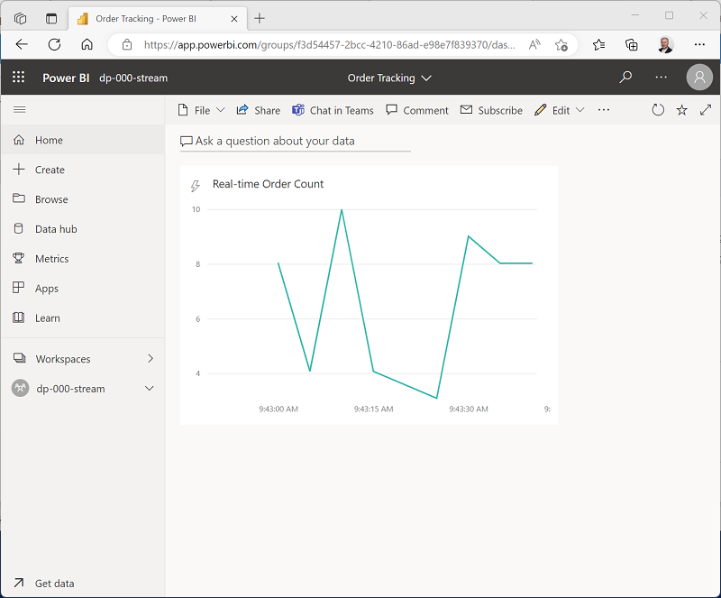

---
lab:
  title: Azure Stream Analytics 및 Microsoft Power BI를 사용하여 실시간 보고서 만들기
  ilt-use: Suggested demo
---

# Azure Stream Analytics 및 Microsoft Power BI를 사용하여 실시간 보고서 만들기

데이터 분석 솔루션에는 종종 데이터 스트림을 수집하고 처리해야 하는 요구 사항이 포함됩니다. 스트림 처리는 스트림이 일반적으로 무한하다는 점에서 일괄 처리와 다릅니다. 즉, 고정 간격이 아닌 영구적으로 처리해야 하는 데이터의 연속 원본입니다.

Azure Stream Analytics는 Azure Event Hubs 또는 Azure IoT Hub 같은 스트리밍 원본의 데이터 스트림에서 작동하는 쿼리를 정의하는 데 사용할 수 있는 클라우드 서비스를 제공합니다. Azure Stream Analytics 쿼리를 사용하여 데이터 스트림을 처리하고 실시간 시각화를 위해 결과를 Microsoft Power BI에 직접 보낼 수 있습니다.

이 연습에서는 Azure Stream Analytics를 사용하여 온라인 소매 애플리케이션에서 생성될 수 있는 것과 같은 판매 주문 데이터의 스트림을 처리합니다. 주문 데이터는 Azure Stream Analytics 작업이 데이터를 읽고 요약한 후 Power BI로 보내기 전에 Azure Event Hubs로 전송됩니다. 여기서 보고서의 데이터를 시각화합니다.

이 연습을 완료하는 데 약 **45**분 정도 소요됩니다.

## 시작하기 전에

관리 수준 액세스 권한이 있는 [Azure 구독](https://azure.microsoft.com/free)이 필요합니다.

또한 Microsoft Power BI 서비스에 액세스해야 합니다. 학교 또는 조직에서 이미 이를 제공하거나 [개인으로 Power BI 서비스에 등록](https://learn.microsoft.com/power-bi/fundamentals/service-self-service-signup-for-power-bi)할 수 있습니다.

## Azure 리소스 프로비전

이 연습에서는 데이터 레이크 스토리지 및 전용 SQL 풀에 액세스할 수 있는 Azure Synapse Analytics 작업 영역이 필요합니다. 스트리밍 주문 데이터를 보낼 수 있는 Azure Event Hubs 네임스페이스도 필요합니다.

PowerShell 스크립트와 ARM 템플릿의 조합을 사용하여 이러한 리소스를 프로비저닝합니다.

1. `https://portal.azure.com`에서 [Azure Portal](https://portal.azure.com)에 로그인합니다.
2. 페이지 위쪽의 검색 창 오른쪽에 있는 **[\>_]** 단추를 사용하여 Azure Portal에서 새 Cloud Shell을 만들고 ***PowerShell*** 환경을 선택하고 메시지가 표시되면 스토리지를 만듭니다. Cloud Shell은 다음과 같이 Azure Portal 아래쪽 창에 명령줄 인터페이스를 제공합니다.

    

    > **참고**: 이전에 *Bash* 환경을 사용하는 클라우드 셸을 만들었다면 클라우드 셸 창의 왼쪽 위에 있는 드롭다운 메뉴를 사용하여 ***PowerShell***로 변경합니다.

3. 창 맨 위에 있는 구분 기호 막대를 끌거나 창 오른쪽 위에 있는 **&#8212;** , **&#9723;** 및 **X** 아이콘을 사용하여 Cloud Shell 크기를 조정하여 창을 최소화, 최대화하고 닫을 수 있습니다. Azure Cloud Shell 사용에 관한 자세한 내용은 [Azure Cloud Shell 설명서](https://docs.microsoft.com/azure/cloud-shell/overview)를 참조하세요.

4. PowerShell 창에서 다음 명령을 입력하여 이 연습이 포함된 리포지토리를 복제합니다.

    ```
    rm -r dp-203 -f
    git clone https://github.com/MicrosoftLearning/dp-203-azure-data-engineer dp-203
    ```

5. 리포지토리가 복제된 후에는 다음 명령을 입력하여 이 연습의 폴더로 변경하고 포함된 **setup.ps1** 스크립트를 실행합니다.

    ```
    cd dp-203/Allfiles/labs/19
    ./setup.ps1
    ```

6. 메시지가 표시되면 사용할 구독을 선택합니다(여러 Azure 구독에 액세스할 수 있는 경우에만 발생).

7. 스크립트가 완료되기를 기다리는 동안 다음 작업을 계속합니다.

## Power BI 작업 영역 만들기

Power BI 서비스에서는 작업 영역에 데이터 세트, 보고서, 기타 리소스를 구성합니다. 모든 Power BI 사용자에게는 이 연습에서 사용할 수 있는 **내 작업 영역**이라는 기본 작업 영역이 있습니다. 그러나 일반적으로 관리하려는 각 개별 보고 솔루션에 대한 작업 영역을 만드는 것이 좋습니다.

1. Power BI 서비스 자격 증명을 사용하여 [https://app.powerbi.com/](https://app.powerbi.com/)에서 Power BI 서비스에 로그인합니다.
2. 왼쪽 메뉴 모음에서 **작업 영역을** 선택합니다(아이콘은 &#128455;과 유사함).
3. **Pro** 라이선스 모드를 선택하여 의미 있는 이름(예: *mslearn-streaming*)을 사용하여 새 작업 영역을 만듭니다.

    > **참고**: 평가판 계정을 사용하는 경우 추가 평가판 기능을 사용하도록 설정해야 할 수 있습니다.

4. 작업 영역을 볼 때 페이지 URL(`https://app.powerbi.com/groups/<GUID>/list`와 유사해야 함)에서 GUID(Globally Unique Identifier)를 확인합니다. 이 GUID는 나중에 필요합니다.

## Azure Stream Analytics를 사용하여 스트리밍 데이터 처리

Azure Stream Analytics 작업은 하나 이상의 입력에서 스트리밍 데이터에 대해 작동하고 결과를 하나 이상의 출력으로 보내는 영구 쿼리를 정의합니다.

### Stream Analytics 작업 만들기

1. Azure Portal 포함된 브라우저 탭으로 다시 전환하고 스크립트가 완료되면 **dp203-*xxxxxxx*** 리소스 그룹이 프로비전된 지역을 확인합니다.
2. Azure Portal의 **홈**페이지에서 **+ 리소스 만들기**를 선택하고 `Stream Analytics job`을 검색합니다. 그런 다음, 다음 속성을 사용하여 **Stream Analytics 작업**을 만듭니다.
    - **구독**: ‘Azure 구독’
    - **리소스 그룹**: 기존 **dp203-*xxxxxxx*** 리소스 그룹을 선택합니다.
    - **이름**: `stream-orders`
    - **지역**: Synapse Analytics 작업 영역이 프로비저닝되는 지역을 선택합니다.
    - **호스팅 환경**: 클라우드
    - **스트리밍 단위**: 1
3. 배포가 완료될 때까지 기다렸다가 배포된 Stream Analytics 작업 리소스로 이동합니다.

### 이벤트 데이터 스트림에 대한 입력 만들기

1. **스트림 주문** 개요 페이지에서 **입력** 페이지를 선택하고 **입력 추가** 메뉴를 사용하여 다음 속성을 사용하여 **이벤트 허브** 입력을 추가합니다.
    - **입력 별칭**: `orders`
    - **구독에서 Event Hub 선택:** 선택됨
    - **구독**: ‘Azure 구독’
    - **Event Hub 네임스페이스**: **이벤트*xxxxxxx*** Event Hubs 네임스페이스 선택
    - **Event Hub 이름**: 기존 **eventhub*xxxxxxx*** 이벤트 허브를 선택합니다.
    - **Event Hub 소비자 그룹**: 기존 **$Default** 소비자 그룹 선택
    - **인증 모드**: 시스템 할당 관리 ID 만들기
    - **파티션 키**: *비워 둠*
    - **이벤트 직렬화 형식**: JSON
    - **인코딩**: UTF-8
2. 입력을 저장하고 입력이 만들어지는 동안 기다립니다. 여러 알림이 표시됩니다. **연결 테스트 성공** 알림을 기다립니다.

### Power BI 작업 영역에 대한 출력 만들기

1. **stream-orders** Stream Analytics 작업에 대한 **출력** 페이지를 봅니다. 그런 다음 **출력 추가** 메뉴를 사용하여 다음 속성을 사용하여 **Power BI** 출력을 추가합니다.
    - **출력 별칭**: `powerbi-dataset`
    - **수동으로 Power BI 설정 선택**: 선택됨
    - **그룹 작업 영역**: *작업 영역에 대한 GUID*
    - **인증 모드**: **사용자 토큰**을 *선택*한 *다음 아래쪽의* **권한 부여** *단추를 사용하여 Power BI 계정에 로그인*
    - **데이터 세트 이름**: `realtime-data`
    - **테이블 이름**: `orders`

2. 출력을 저장하고 출력이 만들어지는 동안 기다립니다. 여러 알림이 표시됩니다. **연결 테스트 성공** 알림을 기다립니다.

### 이벤트 스트림을 요약하는 쿼리 만들기

1. **stream-orders** Stream Analytics 작업에 대한 **쿼리** 페이지를 봅니다.
2. 기본 쿼리를 다음과 같이 수정합니다.

    ```
    SELECT
        DateAdd(second,-5,System.TimeStamp) AS StartTime,
        System.TimeStamp AS EndTime,
        ProductID,
        SUM(Quantity) AS Orders
    INTO
        [powerbi-dataset]
    FROM
        [orders] TIMESTAMP BY EventEnqueuedUtcTime
    GROUP BY ProductID, TumblingWindow(second, 5)
    HAVING COUNT(*) > 1
    ```

    이 쿼리는 **System.Timestamp**(**EventEnqueuedUtcTime** 필드 기반)를 사용하여 각 제품 ID의 총 수량이 계산되는 각 5초 *연속*(겹치지 않는 순차적) 창의 시작과 끝을 정의하는지 확인합니다.

3. 쿼리를 저장합니다.

### 스트리밍 작업을 실행하여 주문 데이터 처리

1. **stream-orders** Stream Analytics 작업의 **개요** 페이지를 보고 **속성** 탭에서 작업에 대한 **입력**, **쿼리**, **출력**, **함수**를 검토합니다. **입력** 및 **출력** 수가 0인 경우 **개요** 페이지의 **&#8635; 새로 고침** 단추를 사용하여 **주문** 입력 및 **powerbi-dataset** 출력을 표시합니다.
2. **&#9655; 시작** 단추를 선택하고 지금 스트리밍 작업을 시작합니다. 스트리밍 작업이 성공적으로 시작되었다는 알림이 표시될 때까지 기다립니다.
3. 클라우드 셸 창을 다시 열고 다음 명령을 실행하여 100개의 주문을 제출합니다.

    ```
    node ~/dp-203/Allfiles/labs/19/orderclient
    ```

4. 주문 클라이언트 앱이 실행되는 동안 Power BI 앱 브라우저 탭으로 전환하고 작업 영역을 봅니다.
5. 작업 영역에 **realtime-data** 데이터 세트가 표시될 때까지 Power BI 앱 페이지를 새로 고칩니다. 이 데이터 세트는 Azure Stream Analytics 작업에 의해 생성됩니다.

## Power BI에서 스트리밍 데이터 시각화

이제 스트리밍 주문 데이터에 대한 데이터 세트가 있으므로 이를 시각적으로 나타내는 Power BI 대시보드를 만들 수 있습니다.

1. PowerBI 브라우저 탭으로 돌아갑니다.

2. 작업 영역에 대한 **+ 새로 만들기** 드롭다운 메뉴에서 **대시보드**를 선택하고 **주문 추적**이라는 새 대시보드를 만듭니다.

3. **주문 추적** dashboard **&#9999;&#65039; 편집** 메뉴를 선택한 다음 **, + 타일 추가를** 선택합니다. 그런 다음 **타일 추가** 창에서 **사용자 지정 스트리밍 데이터를** 선택하고 **다음**을 선택합니다.

4. **사용자 지정 스트리밍 데이터 추가 타일** 창의 **데이터 세트** 아래에서 **실시간 데이터 데이터** 세트를 선택하고 **다음**을 선택합니다.

5. 기본 시각화 유형을 **꺾은선형 차트**로 변경합니다. 그런 다음, 다음 속성을 설정하고 **다음**을 선택합니다.
    - **축**: EndTime
    - **값**: 주문
    - **표시할 시간 창**: 1분

6. **타일 세부 정보** 창에서 **제목**을 **실시간 주문 수**로 설정하고 **적용**을 선택합니다.

7. Azure Portal이 포함된 브라우저 탭으로 다시 전환하고 필요한 경우 클라우드 셸 창을 다시 엽니다. 그런 다음, 다음 명령을 다시 실행하여 다른 100개의 주문을 제출합니다.

    ```
    node ~/dp-203/Allfiles/labs/19/orderclient
    ```

8. 주문 제출 스크립트가 실행되는 동안 **주문 추적** Power BI 대시보드가 포함된 브라우저 탭으로 다시 전환하고 시각화가 Stream Analytics 작업(계속 실행 중임)에서 처리될 때 새 주문 데이터를 반영하도록 업데이트되는지 확인합니다.

    

    **orderclient** 스크립트를 다시 실행하고 실시간 대시보드에서 캡처되는 데이터를 관찰할 수 있습니다.

## 리소스 삭제

Azure Stream Analytics 및 Power BI 탐색을 완료했으므로, 지금까지 만든 리소스를 삭제하여 불필요한 Azure 비용을 방지해야 합니다.

1. Power BI 보고서가 포함된 브라우저 탭을 닫습니다. 그런 다음, **작업 영역** 창의 작업 영역에 대한 **&#8942;** 메뉴에서 **작업 영역 설정**을 선택하고 작업 영역을 삭제합니다.
2. Azure Portal이 포함된 브라우저 탭으로 돌아가서 클라우드 셸 창을 닫고 **&#128454; 중지** 단추를 사용하여 Stream Analytics 작업을 중지합니다. Stream Analytics 작업이 성공적으로 중지되었다는 알림을 기다립니다.
3. Azure Portal의 **홈** 페이지에서 **리소스 그룹**을 선택합니다.
4. Azure Event Hub 및 Stream Analytics 리소스를 포함하는 **dp203-*xxxxxxx*** 리소스 그룹을 선택합니다.
5. 리소스 그룹의 **개요** 페이지에서 **리소스 그룹 삭제**를 선택합니다.
6. **dp203-*xxxxxxx*** 리소스 그룹 이름을 입력하여 삭제 의사를 확인한 다음, **삭제**를 선택합니다.

    몇 분 후에 이 연습에서 만든 리소스가 삭제됩니다.
