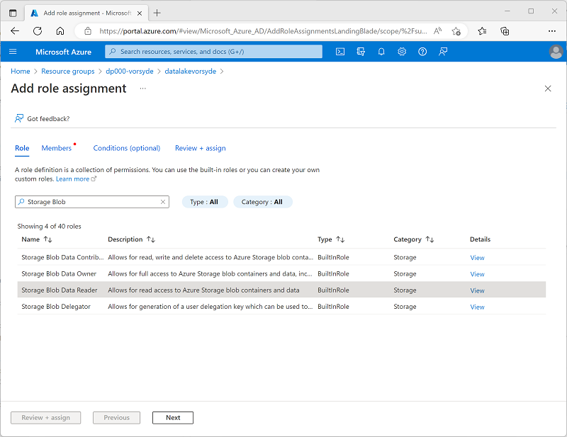
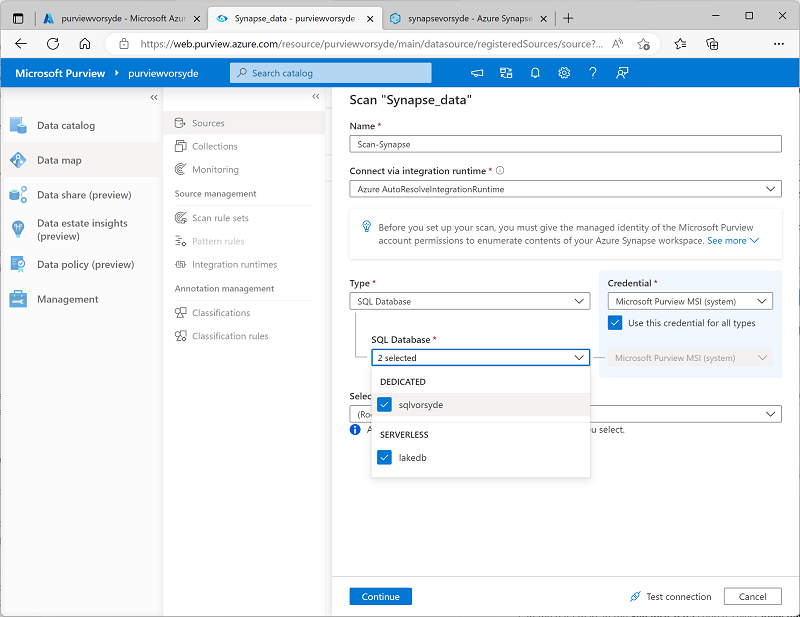

---
lab:
  title: Azure Synapse Analytics에서 Microsoft Purview 사용
  ilt-use: Lab
---

> **중요**: Azure 테넌트당 사용 가능한 Microsoft Purview 계정 수를 제한하도록 Microsoft Purview가 업데이트되었습니다. 따라서 이 랩은 강사 진행 교육 과정에서 사용되는 많은 호스트된 랩 환경을 비롯한 공유 테넌트 환경에서 지원되지 않습니다.

# Azure Synapse Analytics에서 Microsoft Purview 사용

Microsoft Purview를 사용하면 데이터 자산 전체에서 데이터 자산을 카탈로그화하고 하나의 데이터 원본에서 다른 데이터 원본으로 데이터가 전송될 때 데이터의 흐름을 추적할 수 있습니다. 이는 포괄적인 데이터 거버넌스 솔루션의 핵심 요소입니다.

이 연습을 완료하는 데 약 **40**분 정도 소요됩니다.

## 시작하기 전에

구독이 정의된 테넌트에 대한 관리 수준 권한 및 단독 액세스 권한이 있는 [Azure 구독](https://azure.microsoft.com/free)이 필요합니다.

## Azure 리소스 프로비전

이 연습에서는 Microsoft Purview를 사용하여 Azure Synapse Analytics 작업 영역에서 자산 및 데이터 계보를 추적합니다. 먼저 스크립트를 사용하여 Azure 구독에서 이러한 리소스를 프로비저닝합니다.

1. `https://portal.azure.com`에서 [Azure Portal](https://portal.azure.com)에 로그인합니다.
2. 페이지 위쪽의 검색 창 오른쪽에 있는 **[\>_]** 단추를 사용하여 Azure Portal에서 새 Cloud Shell을 만들고 ***PowerShell*** 환경을 선택하고 메시지가 표시되면 스토리지를 만듭니다. Cloud Shell은 다음과 같이 Azure Portal 아래쪽 창에 명령줄 인터페이스를 제공합니다.

    

    > **참고**: 이전에 *Bash* 환경을 사용하는 클라우드 셸을 만들었다면 클라우드 셸 창의 왼쪽 위에 있는 드롭다운 메뉴를 사용하여 ***PowerShell***로 변경합니다.

3. 창 맨 위에 있는 구분 기호 막대를 끌거나 창 오른쪽 위에 있는 **&#8212;** , **&#9723;** 및 **X** 아이콘을 사용하여 Cloud Shell 크기를 조정하여 창을 최소화, 최대화하고 닫을 수 있습니다. Azure Cloud Shell 사용에 관한 자세한 내용은 [Azure Cloud Shell 설명서](https://docs.microsoft.com/azure/cloud-shell/overview)를 참조하세요.

4. PowerShell 창에서 다음 명령을 입력하여 이 리포지토리를 복제합니다.

    ```
    rm -r dp-203 -f
    git clone https://github.com/MicrosoftLearning/dp-203-azure-data-engineer dp-203
    ```

5. 리포지토리가 복제된 후에는 다음 명령을 입력하여 이 랩의 폴더로 변경하고 포함된 **setup.ps1** 스크립트를 실행합니다.

    ```
    cd dp-203/Allfiles/labs/22
    ./setup.ps1
    ```

6. 메시지가 표시되면 사용할 구독을 선택합니다(여러 Azure 구독에 액세스할 수 있는 경우에만 발생).
7. 메시지가 표시되면 Azure SQL Database에 적절한 암호를 입력합니다.

    > **참고**: 이 암호를 기억하세요!

8. 스크립트가 완료될 때까지 기다리세요. 일반적으로 약 15분이 걸리지만 경우에 따라 더 오래 걸릴 수 있습니다. 기다리는 동안 Microsoft Purview 설명서의 [Microsoft Purview 거버넌스 포털에서 사용할 수 있는 항목](https://docs.microsoft.com/azure/purview/overview) 문서를 검토합니다.

> **팁**: 설치 스크립트를 실행한 후 랩을 완료하지 않기로 결정한 경우 불필요한 Azure 비용을 방지하기 위해 Azure 구독에서 만든 **dp203-*xxxxxxx*** 리소스 그룹을 삭제해야 합니다.

## 레이크 데이터베이스 만들기

레이크 데이터베이스는 Azure Storage의 데이터 레이크에 데이터를 저장합니다. Parquet, Delta 또는 CSV 형식 및 다른 설정을 사용하여 스토리지를 최적화할 수 있습니다. 각 레이크 데이터베이스에는 루트 데이터 폴더를 정의하는 연결된 서비스가 있습니다.

레이크 데이터베이스는 Synapse SQL 서버리스 SQL 풀 및 Apache Spark에서 액세스할 수 있으므로 사용자는 스토리지를 컴퓨팅과 분리할 수 있습니다. 레이크 데이터베이스의 메타데이터를 사용하면 여러 엔진에서 통합된 환경을 제공하고 데이터 레이크에서 지원되지 않는 추가 정보(예: 관계)를 사용하기 쉬워집니다.

1. 레이크 데이터베이스를 만들려면 먼저 적절한 리소스 그룹에서 synapsexxxxxxx를 연 다음 **Synapse Studio 열기**에서 ***열기*** 링크를 클릭합니다. 
2. 다음으로 렌치 모양이 있는 도구 상자를 클릭합니다. 이 도구 상자는 Synapse Analytics 작업 영역의 관리 섹션이기도 하며 전용 풀이 실행 중인지 확인합니다. 시작하는 데 몇 분 정도 걸릴 수 있습니다.
3. 여기에서 통 모양에 데이터 레이블이 있는 데이터베이스 기호를 클릭합니다.
4. 데이터 패널에서 **데이터**라는 단어의 오른쪽에 있는 + 기호를 클릭하고 ***레이크 데이터베이스***를 선택합니다.
   
    

> **참고**: **확인** 단추를 클릭하기 전에 읽고 이해해야 하는 **Azure Synapse 데이터베이스 템플릿 사용 약관**에 대한 메시지가 표시됩니다.

5. 맨 오른쪽에는 속성 창이 있습니다.
   1. 이름 필드에 **lakedb**를 입력합니다.
   1. **입력 폴더**에서 폴더를 선택하고 루트/파일/데이터로 이동한 다음 **확인**을 누릅니다.

>**참고**: **입력 폴더**를 열 때 오류가 표시될 수 있습니다. 그런 경우 루트 폴더를 두 번 클릭하고 데이터까지 이동한 후 **확인**을 클릭하면 됩니다.

   1. 이 화면의 왼쪽에는 **lakedb** 이름이 있는 기둥이 있습니다. 그 아래에 있는 **+테이블**을 클릭하고 ***데이터 레이크에서***를 선택합니다.
   1. ***외부 테이블 이름*** 아래에 **Products**라고 입력합니다.
   1. ***연결된 서비스***에서 기본 옵션을 선택합니다.
   1. ***입력 파일 또는 폴더*** 내에서 맨 오른쪽에 있는 파일 폴더를 클릭하고 **루트 > 파일 > 데이터 >** 로 이동하여 ***products.csv***를 선택하고 **확인**을 클릭한 다음 **계속**을 클릭합니다.

6. **새 외부 테이블** 창에서 첫 번째 행 옵션 ***열 이름 유추***를 선택한 다음 **만들기**를 클릭합니다.


7. 쿼리 디자인 창의 맨 위에 있는 **게시**를 누릅니다.
8. **데이터**에서 왼쪽의 **작업 영역** 영역에 있는지 확인하고 **레이크 데이터베이스** 섹션, **lakedb**를 확장한 다음 **Products** 테이블의 오른쪽에 ***마우스를 놓고*** ***상위 100개 행***을 선택합니다.


> **참고**: **연결 대상**이 **기본 제공**으로 나열되어 있는지 확인하고 **master** 데이터베이스를 선택된 상태로 두거나 오른쪽에 있는 새로 고침 버튼을 클릭하고 **lakedb** 데이터베이스를 선택할 수 있습니다. 3부분 명명 규칙 [database].[schema].[table]을 사용하므로 둘 다 작동합니다.


9. **실행** 단추를 눌러 레이크 데이터베이스 테이블 내의 데이터를 봅니다.

## 계정에 Microsoft Purview 서비스 추가

Microsoft Purview는 데이터 거버넌스, 정보 보호, 위험 관리 및 규정 준수 솔루션에 걸친 포괄적인 제품 포트폴리오입니다. 온-프레미스, 다중 클라우드, SaaS(Software as a Service) 데이터 전반에서 전체 데이터 자산을 제어, 보호, 관리하는 데 도움이 됩니다.

이를 설정하려면 먼저 할당된 임의 번호에 따라 dp203-xxxxxxx라고 명명되는 기본 리소스 그룹으로 돌아가게 됩니다. **리소스 그룹** 내로 이동했다면 ***+ 만들기*** 단추를 클릭하여 새 서비스를 추가합니다.

1. **Microsoft Purview 서비스**를 선택한 다음 **만들기** 단추를 클릭합니다.
2. 적절한 리소스 그룹에서 시작했으므로 만들기 프로세스 중에 이미 선택되어 있을 것입니다. 다음으로 임의로 할당된 번호를 사용하여 **Purview**에 이름을 지정합니다. 그런 다음 인스턴스에 가장 적합한 지역을 선택합니다.

   

3. **검토 및 만들기** 단추를 클릭하고 계속 진행하기 전 ***유효성 검사*** 결과를 기다립니다.

   

4. 유효성 검사가 통과되면 **만들기** 단추를 누릅니다.

> **참고**: Purview 유효성 검사를 통과하려면 몇 가지 지역을 시도해야 할 수 있습니다.

## Microsoft Purview에서 Azure Synapse Analytics 데이터 자산 카탈로그 만들기

Microsoft Purview를 사용하면 Azure Synapse 작업 영역의 데이터 원본을 포함하여 데이터 자산 전체에서 데이터 자산을 카탈로그화할 수 있습니다. 방금 배포한 작업 영역에는 데이터 레이크(Azure Data Lake Storage Gen2 계정), 서버리스 데이터베이스 및 전용 SQL 풀의 데이터 웨어하우스가 포함됩니다.

### Microsoft Purview에 대한 역할 기반 액세스 구성

Microsoft Purview는 관리 ID를 사용하도록 구성됩니다. 데이터 자산을 카탈로그화하려면 이 관리 ID 계정이 Azure Synapse Analytics 작업 영역 및 데이터 레이크 저장소에 대한 스토리지 계정에 액세스할 수 있어야 합니다.

1. [Azure Portal](https://portal.azure.com)에서 설치 스크립트에서 만든 **dp203-*xxxxxxx*** 리소스 그룹을 찾아 만든 리소스를 봅니다. 이러한 위협은 다음과 같습니다.
    - **datalake*xxxxxxx***와 유사한 이름을 가진 스토리지 계정입니다.
    - **purview*xxxxxxx***와 유사한 이름을 가진 Microsoft Purview 계정입니다.
    - **sql*xxxxxxx***와 유사한 이름을 가진 전용 SQL 풀입니다.
    - **synapse*xxxxxxx***와 유사한 이름을 가진 Synapse 작업 영역입니다.
2. **datalake*xxxxxxx*** 스토리지 계정을 열고 해당 **IAM(Access Control)** 페이지에서 **다음과 같이 역할 할당 탭**을 봅니다.

    

3. **+ 추가** 단추 메뉴에서 **역할 할당 추가**를 선택합니다. 
4. **역할 할당 추가** 페이지의 **역할** 탭에서 “storage blob”을 검색하고 **Storage Blob 데이터 읽기 권한자** 역할을 선택합니다. 그런 다음 **다음**을 선택하여 **멤버** 탭으로 이동합니다.

    

5. **멤버** 탭의 **액세스 할당 대상** 목록에서 **관리 ID**를 선택합니다. 그런 다음 **멤버**에서 **멤버 선택**을 선택합니다.
6. **관리 ID 선택** 창의 **관리 ID** 목록에서 **Microsoft Purview 계정(*n*)** 을 선택하고 ,**purview*xxxxxxx***와 유사한 이름이 있어야 하는 Microsoft Purview 계정을 선택합니다. 그리고 **선택** 단추를 사용하여 역할 할당에 이 계정을 추가합니다.

    

7. **검토 + 할당** 단추를 사용하여 역할 할당을 완료하면 Microsoft Purview 리소스에 대한 관리 ID에서 사용하는 **purview*xxxxxxx*** 계정이 스토리지 계정에 대한 **Storage Blob 데이터 읽기 권한자** 역할의 멤버가 됩니다.
8. Azure Portal에서 **dp203-*xxxxxxx*** 리소스 그룹으로 돌아가서 **synapse*xxxxxxx*** Synapse Analytics 작업 영역을 엽니다. 그런 다음 **IAM(액세스 제어)** 페이지에서 역할 할당을 추가하여 **purview*xxxxxxx*** 관리 ID 계정을 작업 영역에서 **읽기 권한자** 역할의 멤버로 만듭니다.

### Microsoft Purview에 대한 데이터베이스 권한 구성

Azure Synapse Analytics 작업 영역에는 Microsoft Purview에서 사용하는 관리 ID가 액세스해야 하는 서버리스 및 전용 SQL 풀의 데이터베이스가 포함됩니다.

1. Azure Portal의 Synapse Analytics 작업 영역 페이지에서 **개요** 탭을 봅니다. 그런 다음 **Synapse Studio 열기** 타일에서 링크를 사용하여 새 브라우저 탭에서 Azure Synapse Studio를 엽니다. 메시지가 표시되면 로그인합니다.

    >**팁**: 또는 새 브라우저 탭에서 https://web.azuresynapse.net 으로 직접 이동하여 Azure Synapse Studio를 열 수 있습니다.

2. Synapse Studio 왼쪽에 있는 **&rsaquo;&rsaquo;** 아이콘을 사용하여 메뉴를 확장합니다. 이렇게 하면 Synapse Studio에서 여러 페이지가 표시됩니다.
3. **관리** 페이지의 **SQL 풀** 탭에서 **sql*xxxxxxx*** 전용 SQL 풀에 대한 행을 선택하고 **&#9655;** 아이콘을 사용하여 시작합니다. 메시지가 표시되면 다시 시작하려는지 확인합니다.

    

4. SQL 풀이 다시 시작될 때까지 기다립니다. 몇 분 정도 걸릴 수 있습니다. **&#8635; 새로 고침** 단추를 사용하여 상태를 주기적으로 확인할 수 있습니다. 준비되면 상태가 **온라인**으로 표시됩니다.
5. Azure Synapse Studio에서 **데이터** 페이지를 보고 **작업 영역** 탭에서 **SQL 데이터베이스**를 확장하여 작업 영역의 데이터베이스를 확인합니다. 이때 다음과 같은 정보를 검토해야 합니다.
    - **lakedb**라는 서버리스 SQL 풀 데이터베이스입니다.
    - **sql*xxxxxxx***라는 전용 SQL 풀 데이터베이스입니다.

    

6. **lakedb** 데이터베이스를 선택한 다음 **...** 메뉴에서 **새 SQL 스크립트** > **빈 스크립트**를 선택하여 새로운 **SQL 스크립트 1** 창을 엽니다. 도구 모음 오른쪽 끝에 있는 **속성** 단추( **&#128463;<sub>*</sub>** 과 유사)를 사용하여 **속성** 창을 숨기고 스크립트 창을 좀 더 쉽게 볼 수 있습니다.
7. **SQL 스크립트 1** 창에서 다음 SQL 코드를 입력하여 ***purviewxxxxxxx***의 모든 인스턴스를 Microsoft Purview 계정의 관리 ID 이름으로 바꿉니다.

    ```sql
    CREATE LOGIN purviewxxxxxxx FROM EXTERNAL PROVIDER;
    GO

    CREATE USER purviewxxxxxxx FOR LOGIN purviewxxxxxxx;
    GO

    ALTER ROLE db_datareader ADD MEMBER purviewxxxxxxx;
    GO
    ```

8. **&#9655; 실행** 단추를 사용하여 스크립트를 실행합니다. 이는 서버리스 풀에 로그인하고 Microsoft Purview에서 사용하는 관리 ID에 대한 **lakedb** 사용자에서 사용자를 만들고 **lakedb** 데이터베이스의 **db_datareader** 역할에 사용자를 추가합니다.
9. **sql*xxxxxxx*** 전용 SQL 풀 데이터베이스에 대해 비어 있는 새 스크립트를 만들고 이를 사용하여 다음 SQL 코드를 실행합니다(***purviewxxxxxxx***를 Microsoft Purview 계정의 관리 ID 이름으로 대체). 이는 Microsoft Purview에서 사용하는 관리 ID에 대한 전용 SQL 풀에 사용자를 만들고 **sql*xxxxxxx*** 데이터베이스의 **db_datareader** 역할에 추가합니다.

    ```sql
    CREATE USER purviewxxxxxxx FROM EXTERNAL PROVIDER;
    GO

    EXEC sp_addrolemember 'db_datareader', purviewxxxxxxx;
    GO
    ```

### Microsoft Purview 카탈로그에 원본 등록

이제 Microsoft Purview에 필요한 액세스를 구성하여 Azure Synapse Analytics 작업 영역에서 사용하는 데이터 원본을 스캔할 수 있으므로 Microsoft Purview 카탈로그에 등록할 수 있습니다.

1. Azure Portal이 포함된 브라우저 탭으로 다시 전환하고 **dp203-*xxxxxxx*** 리소스 그룹에 대한 페이지를 봅니다.
2. **purview*xxxxxxx*** Microsoft Purview 계정을 열고 해당 **개요** 페이지에서 링크를 사용하여 새 브라우저 탭에서 **Microsoft Purview 거버넌스 포털**을 엽니다. 메시지가 표시되면 로그인합니다.

    >**팁**: 또는 새 브라우저 탭에서 https://web.purview.azure.com 으로 직접 이동할 수 있습니다.

3. Azure Purview 거버넌스 포털의 왼쪽에서 **&rsaquo;&rsaquo;** 아이콘을 사용하여 메뉴를 확장합니다. 이렇게 하면 포털 내의 다른 페이지가 표시됩니다.
4. **데이터 맵** 페이지의 **원본** 하위 페이지에서 **등록**을 선택합니다.

    

5. 표시되는 **원본 등록** 탭에서 **Azure Synapse Analytics**를 선택하고 계속해서 다음 설정으로 원본을 계속 등록합니다.
    - **이름**: Synapse_data
    - **Azure 구독**: *Azure 구독 선택*
    - **작업 영역 이름**: ***synapsexxxxxxx** 작업 영역 선택*
    - **전용 SQL 엔드포인트**: sql*xxxxxxx*.sql.azuresynapse.net
    - **전용 SQL 엔드포인트**: sql*xxxxxxx*ndemand.sql.azuresynapse.net
    - **컬렉션 선택**: 루트(purview*xxxxxxx*)

    이 데이터 원본에는 Azure Synapse Analytics 작업 영역의 SQL 데이터베이스가 포함됩니다.

6. **Synapse_data** 원본을 등록한 후 다시 **등록**을 선택하고 Azure Synapse 작업 영역에서 사용하는 데이터 레이크 스토리지에 대한 두 번째 원본을 등록합니다. **Azure Data Lake Storage Gen2**를 선택하고 다음 설정을 지정합니다.
    - **이름**: Data_lake
    - **Azure 구독**: *Azure 구독 선택*
    - **작업 영역 이름**: ***datalakexxxxxxx** 스토리지 계정 선택*
    - **엔드포인트**: https:/ /datalakexxxxxxx.dfs.core.windows.net/
    - **컬렉션 선택**: 루트(purview*xxxxxxx*)
    - **데이터 사용 관리**: 사용할 수 없음

    **Synapse_data** 및 **Data_lake** 원본을 모두 등록하면 다음과 같이 데이터 맵의 **purview*xxxxxxx*** 루트 컬렉션 아래에 둘 다 표시되어야 합니다.

    

### 등록된 원본 스캔

1. 데이터 맵의 **Synapse_data** 원본에서 **세부 정보 보기**를 선택합니다. 원본에 카탈로그된 자산이 없는지 확인합니다. 원본을 스캔하여 포함된 데이터 자산을 찾아야 합니다.
2. **Synapse_data** 세부 정보 페이지에서 **새 스캔**을 선택한 다음, 다음 설정을 사용하여 스캔을 구성합니다.
    - **이름**: Scan-Synapse
    - **통합 런타임에 연결**: Azure AutoresolveIntegrationRuntime
    - **형식**: SQL Database
    - **자격 증명**: Microsoft Purview MSI(시스템)
    - **SQL Database**: **sqlxxxxxxx** 전용 데이터베이스와 **lakedb** 서버리스 데이터베이스를 <u>모두</u> 선택합니다.
    - **컬렉션 선택**: 루트(purview*xxxxxxx*)

    

3. 기본 **AzureSynapseSQL** 규칙 집합을 선택해야 하는 **스캔 규칙 집합 선택** 페이지로 계속 이동합니다.
4. **스캔 트리거 설정** 페이지로 계속 이동하고 **한 번**을 선택하여 스캔을 한 번 실행합니다.
4. **스캔 검토** 페이지로 이동한 다음, 스캔을 저장하고 실행합니다.
6. **Synapse_data** 스캔이 실행되는 동안 **원본** 페이지로 돌아가 데이터 맵을 보고 **Data_lake** 원본에서 **새 스캔** 아이콘을 사용하여 다음 설정으로 데이터 레이크 스캔을 시작합니다.
    - **이름**: Scan-Data-Lake
    - **통합 런타임에 연결**: Azure AutoresolveIntegrationRuntime
    - **자격 증명**: Microsoft Purview MSI(시스템)
    - **컬렉션 선택**: 루트(purview*xxxxxxx*)
    - **스캔 범위 지정**: **Data_lake** 및 모든 하위 자산 선택 
    - **스캔 규칙 집합 선택**: AdlsGen2
    - **스캔 트리거 설정**: 한 번
    - **스캔 검토** 저장 및 실행
7. 두 스캔이 모두 완료되기를 기다립니다. 몇 분 정도 걸릴 수 있습니다. 아래와 같이 각 원본의 세부정보 페이지를 보고 **마지막 실행 상태**를 확인할 수 있습니다( **&#8635; 새로 고침** 단추를 사용하여 상태를 업데이트할 수 있음). **모니터링** 페이지를 볼 수도 있습니다(스캔이 표시되는 데 다소 시간이 걸릴 수 있음).

    

### 스캔한 자산 보기

1. **데이터 카탈로그** 페이지의 **찾아보기** 하위 페이지에서 **purview*xxxxxxx*** 컬렉션을 선택합니다. Azure Synapse Analytics 작업 영역, 데이터 레이크용 Azure Storage 계정, Azure Synapse Analytics의 두 SQL 풀 데이터베이스, 각 데이터베이스의 **dbo** 스키마, 데이터베이스의 테이블 및 보기, 데이터 레이크의 폴더 및 파일을 포함하여 여기에서 Azure Synapse 작업 영역 및 데이터 레이크 스토리지에서 카탈로그화된 데이터 자산을 확인할 수 있습니다.
2. 결과를 필터링하려면 개체 형식별 **결과 좁히기** 목록에서 **파일** 및 **테이블**을 선택하여 스캔으로 카탈로그화된 파일, 테이블 및 보기만 나열되도록 합니다.

    

    데이터 자산에는 다음이 포함됩니다.

    - **제품** - 제품 데이터에 대한 전용 SQL 풀의 테이블입니다.
    - **products.csv** - 데이터 레이크의 파일입니다.
    - **products_csv** - *products.csv* 파일에서 제품 데이터를 읽는 서버리스 SQL 풀의 보기입니다.

3. 자산을 선택하고 해당 속성 및 스키마를 보고 찾은 자산을 탐색합니다. 데이터 분석가가 Microsoft Purview 데이터 카탈로그에서 탐색하여 데이터 자산에서 데이터 자산에 대한 많은 정보를 찾을 수 있도록 자산의 속성(개별 필드 포함)을 편집하여 메타데이터, 범주화, 주제 전문가를 위한 연락처 세부 정보 및 기타 유용한 세부 정보를 추가할 수 있습니다.

지금까지 Azure Synapse Analytics 작업 영역에서 Microsoft Purview를 사용하여 데이터 자산을 카탈로그화했습니다. Microsoft Purview 카탈로그에 여러 종류의 데이터 원본을 등록하여 데이터 자산의 중앙 통합 보기를 만들 수 있습니다.

이제 Azure Synapse Analytics와 Microsoft Purview를 통합하는 몇 가지 다른 방법을 살펴보겠습니다.

## Microsoft Purview와 Azure Synapse Analytics 통합

Azure Synapse Analytics는 Microsoft Purview와의 통합을 지원하여 데이터 자산을 검색 가능하게 하고 한 원본에서 다른 원본으로 데이터를 전송하는 수집 파이프라인을 통해 데이터 계보를 추적합니다.

### Azure Synapse Analytics에서 Microsoft Purview 통합 사용

1. Synapse Studio가 포함된 브라우저 탭으로 다시 전환하고 **관리** 페이지에서 **Microsoft Purview** 탭을 선택한 다음 **Purview 계정에 연결** 단추를 사용하여 구독의 **purview*xxxxxxx*** 계정을 작업 영역에 연결합니다.
2. 계정을 연결한 후 **Purview 계정** 탭을 보고 계정이 **데이터 계보 - Synapse 파이프라인** 상태가 **연결됨**인지 확인합니다.

    

### Synapse Studio에서 Purview 카탈로그 검색

이제 Microsoft Purview 계정을 Azure Synapse Analytics 작업 영역에 연결했으므로 Synapse Studio 카탈로그를 검색하여 데이터 자산 전체에서 데이터 자산을 검색할 수 있습니다.

1. Synapse Studio에서 **통합** 페이지를 봅니다.
2. 페이지 상단에서 상단의 **검색** 상자를 사용하여 다음과 같이 “제품”이라는 용어에 대한 **Purview** 원본을 검색합니다.

    

3. 결과에서 **products.csv**를 선택하여 Purview 카탈로그에서 세부 정보를 봅니다.

Purview 카탈로그를 Synapse Studio 인터페이스에 통합하면 데이터 분석가와 엔지니어는 Azure Synapse Studio 작업 영역 내뿐만 아니라 전체 데이터 자산에서 등록된 데이터 자산을 찾아서 검토할 수 있습니다.

### 파이프라인 만들기 및 실행

**lakedb** 데이터베이스의 **products_csv** 보기는 제품 데이터가 포함된 데이터 레이크의 텍스트 파일을 기반으로 합니다. **sql*xxxxxxx*** 전용 SQL 데이터베이스의 **제품** 테이블이 현재 비어 있습니다. Synapse 파이프라인을 사용하여 데이터 레이크의 데이터를 테이블로 로드해 보겠습니다.

1. Synapse Studio에서 **통합** 페이지의 **+** 메뉴에서 **데이터 복사 도구**를 선택합니다.
2. 데이터 복사 도구에서 **기본 제공 복사 작업**을 선택하고 **지금 한 번 실행**한 다음 **다음**을 선택합니다.
3. **원본 데이터 저장소** 페이지의 **연결** 목록에서 **synapse*xxxxxxx*-WorkspaceDefaultStorage** 연결(작업 영역용 데이터 레이크 참조)을 선택합니다. **파일 또는 폴더**의 경우 **files/products/products.csv** 파일을 찾습니다. 그런 후 **다음**을 선택합니다.
4. **파일 형식 설정** 페이지에서 **텍스트 형식 검색**을 선택합니다. 그런 다음 **다음**을 선택하기 전에 다음 설정을 지정해야 합니다.
    - **파일 형식**: DelimitedText
    - **열 구분 기호**: 쉼표(,)
    - **행 구분 기호**: 줄 바꿈(\n)
    - **첫 번째 행을 머리글로**: 선택됨
    - **압축 형식**: 없음
5. **대상 데이터 저장소** 페이지의 **연결** 목록에서 **sql*xxxxxxx***(전용 SQL 풀에 대한 연결)를 선택합니다. 그런 다음 대상을 기존 **dbo.products** 테이블로 설정하고 **다음**을 선택합니다.
6. **열 매핑** 페이지에서 기본 열 매핑을 검토하고 **다음**을 선택합니다.
7. **설정** 페이지에서 **작업 이름** **을 Load_Product_Data**로 설정합니다. 그런 다음 **대량 삽입** 복사 메서드를 선택하고 **다음**을 선택합니다.
8. **요약** 페이지에서 **다음**을 선택합니다.
9. 파이프라인이 배포될 때까지 기다린 다음 **마침**을 선택합니다.
10. Synapse Studio에서 **모니터** 페이지를 봅니다. 그런 다음 **파이프라인 실행** 탭에서 **Load_Product_Data** 파이프라인의 상태를 확인합니다. 상태가 **성공**으로 변경되는 데 몇 분 정도 걸릴 수 있습니다.
11. 파이프라인 실행이 성공적으로 완료되면 해당 이름(**Load_Product_Data**)을 선택하여 파이프라인의 활동 세부정보를 봅니다. 파이프라인에 **Copy_* xxx***와 같이 자동으로 파생된 이름을 가진 **데이터 복사** 작업이 포함되어 있는지 확인합니다. 이 활동은 데이터 레이크의 텍스트 파일에서 **sql*xxxxxxx*** 데이터베이스의 **제품** 테이블로 데이터를 복사했습니다.

### Microsoft Purview에서 데이터 계보 보기

Synapse 파이프라인을 사용하여 데이터를 데이터베이스에 로드했습니다. 이 작업이 Microsoft Purview에서 추적되었는지 확인해 보겠습니다.

1. Microsoft Purview 거버넌스 포털이 포함된 브라우저 탭으로 전환합니다.
2. **데이터 카탈로그** 페이지의 **찾아보기** 하위 페이지에서 **purview*xxxxxxx*** 컬렉션을 선택합니다.
3. **데이터 파이프라인**, **파일** 및 **테이블**만 표시하도록 자산을 필터링합니다. 자산 목록에는 **products.csv** 파일, **Copy_*xxx*** 파이프라인 작업 및 **제품** 테이블이 포함되어야 합니다.
4. **Copy_*xxx*** 자산을 선택하여 세부 정보를 확인합니다. **업데이트된 시간**은 최근 파이프라인 실행을 반영합니다.
5. **Copy_*xxx*** 자산의 **계보** 탭에서 **products.csv** 파일에서 **제품** 테이블로의 데이터 흐름을 보여주는 다이어그램을 봅니다.

    

6. **Copy_*xxx*** 계보 다이어그램에서 **products.csv** 파일을 선택하고 **자산으로 전환** 링크를 사용하여 원본 파일의 세부 정보를 봅니다.
7. **products.csv** 계보 다이어그램에서 **제품** 테이블을 선택하고 **자산으로 전환** 링크를 사용하여 테이블의 세부정보를 봅니다(테이블 계보 다이어그램을 보려면 **&#8635; 새로 고침** 단추를 사용해야 할 수 있음).

Azure Synapse Analytics를 Microsoft Purview와 통합하여 사용하도록 설정된 계보 추적 기능을 사용하면 데이터 저장소의 데이터가 로드된 방법과 시기 및 출처를 확인할 수 있습니다.

> **팁**: 이 연습에서는 Microsoft Purview 거버넌스 포털에서 계보 정보를 확인했습니다. 하지만 검색 통합 기능을 통해 Synapse Studio에서 동일한 자산을 볼 수도 있습니다.

### 전용 SQL 풀 일시 중지

1. Synapse Studio 탭으로 다시 전환하고 **관리** 페이지에서 **sql*xxxxxxx*** 전용 SQL 풀을 일시 중지합니다.

## Azure 리소스 삭제

Azure Synapse Analytics 탐색을 완료했으므로, 지금까지 만든 리소스를 삭제하여 불필요한 Azure 비용을 방지해야 합니다.

1. Synapse Studio 브라우저 탭을 닫고 Azure Portal로 돌아갑니다.
2. Azure Portal의 **홈** 페이지에서 **리소스 그룹**을 선택합니다.
3. (관리되는 리소스 그룹이 아닌) Synapse Analytics 작업 영역에 대한 **dp203-*xxxxxxx*** 리소스 그룹을 선택하고 Synapse 작업 영역, 스토리지 계정, 작업 영역용 전용 SQL 풀이 포함되어 있는지 확인합니다.
4. 리소스 그룹의 **개요** 페이지에서 **리소스 그룹 삭제**를 선택합니다.
5. **dp203-*xxxxxxx*** 리소스 그룹 이름을 입력하여 삭제 의사를 확인한 다음, **삭제**를 선택합니다.

    몇 분이 지나면 Azure Synapse 작업 영역 리소스 그룹과 여기에 연결된 관리 작업 영역 리소스 그룹이 삭제됩니다.
